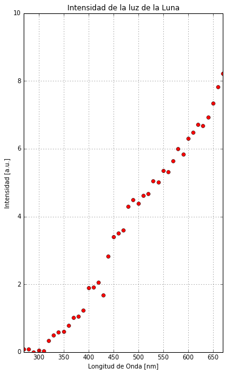
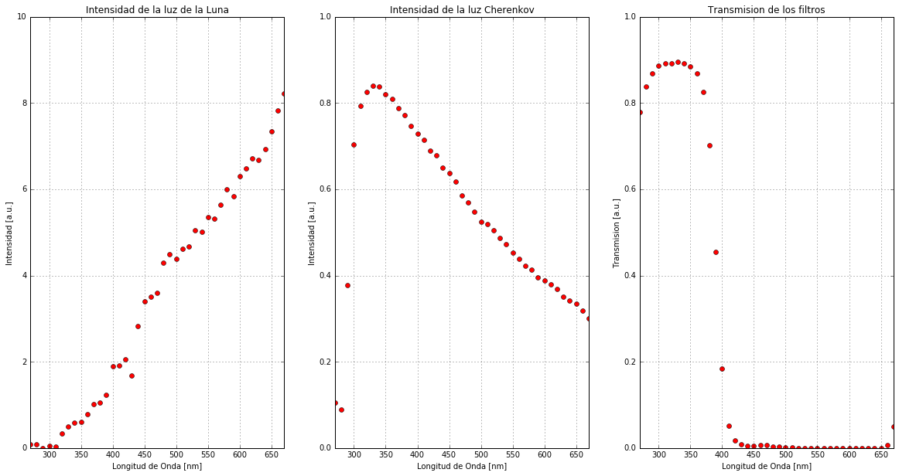

# La llibreta científica del Daniel
Aquesta és la meva **llibreta científica**. Aquí puc veure les **dades** dels telescopis, fer **càlculs** i **anotacions**. És una eina més dels Caçadors de Raigs Gamma. Tots els Caçadors tenim la nostra i tu tens la teva a **La teva Nit**.

El millor és entendre com funciona amb un exemple. Així que calcularem si els filtres que hem dissenyat són els adequats o no.

Tenim 3 conjunts de dades.

- Un té les dades de la quantitat de **llum de lluna** que arriba als telescopis.
- Un altre té les dades de la **llum dels rajos gammas** que ens arriba als telescopis.
- L'últim té la informació de quanta llum (de la lluna o dels gammas) passa pel filtre.

Cada fitxer ens mostra la informació per longitud d'ona.

Llegim ara el conjunt de dades que ens indica la quantitat de **llum de la lluna** que arriba als telescopis:


```python
%matplotlib inline
from noche1_2 import *
```


```python
leer("luna")
```

    LongitudOnda  Emision
    ------------ ---------
             270    0.0921
             280  0.077652
             290 0.0042408
             300  0.049055
             310  0.034728
             320   0.33099
             330    0.4941
             340   0.58336
             350   0.59861
             360   0.79136
             ...       ...
             570    5.6372
             580    6.0073
             590    5.8452
             600    6.3041
             610    6.4821
             620    6.7191
             630    6.6753
             640    6.9272
             650    7.3382
             660    7.8201
             670    8.2151
    Length = 41 rows


-----------
Això és el que significa cada columna
- La primera columna és la **Longitud d'ona** mesurada nanòmetres.
- La segona és la **intensitat de l'emissió de la lluna**. Les unitats de la intensitat són arbitràries (a.u).

Mirar així les dades serveix per veure quin format tenen, però per treure més informació d'elles és molt millor representar-les gràficament.

Atent als eixos de la gràfica. A l'eix de les X tenim la longitud d'ona, i en el de les Y tenim l'emissió de la Lluna. Fixa't també en l'escala de l'eix de les Y.


```python
grafica("luna")
```





Amb el gràfic és fàcil de veure que la quantitat de **llum de lluna** (per cert, ja saps que en realitat no és llum de la lluna ja que la lluna només la reflecteix, no?) Augmenta per a longituds d'ona majors .

----------

Mirem què passa amb la **llum dels raigs gamma** i els filtres:


```python
grafica("luna")
grafica("gammas")
grafica("filtro")
```




Ara podem comparar quanta llum ens arriba de la lluna i quanta ens arriba dels gammas.

- **De quin ens arriba més intensitat? De la Lluna o dels Gammas?**
- **Saps veure quina part de la llum deixa passar el filtre i quina part l'absorbeix?**

La llum que ens arriba dels gamma augmenta molt ràpid amb la longitude d'ona entre 250 i 350 nanòmetres, però després, al contrari de la que ens arriba de la lluna, disminueix per a longituds d'ona majors. Per això vam escollir un filtre que tingués una bona transmissió per sota de 350 nanòmetres i que no deixés passar llum per sobre de 400 nanòmetres.

----------

És el moment de calcular quanta llum de la lluna i dels gammas passa el filtre. L'objectiu és que el filtre elimini la lluna però no els gammas. Però no hi ha cap filtre perfecte.

El càlcul és simple: hem de multiplicar * la intensitat de la lluna * per * el filtre * per a cada longitud d'ona.


```python
multiplicar("luna","filtro")
```

    totalluna: 144.48
    lunafiltrada:
    [  7.18380000e-02   6.51500280e-02   3.68525520e-03   4.34627300e-02
       3.09773760e-02   2.95574070e-01   4.42713600e-01   5.20357120e-01
       5.29769850e-01   6.87691840e-01   8.37316200e-01   7.43137200e-01
       5.62607500e-01   3.47318400e-01   9.97204000e-02   3.71880000e-02
       1.34568000e-02   1.41795000e-02   1.69920000e-02   2.11032000e-02
       2.16384000e-02   1.72076000e-02   1.34841000e-02   4.39160000e-03
       4.62880000e-03   9.34700000e-04   4.04688000e-04   3.00882000e-04
       3.74871000e-04   2.12456000e-04   0.00000000e+00   0.00000000e+00
       0.00000000e+00   0.00000000e+00   0.00000000e+00   0.00000000e+00
       6.67530000e-05   4.15632000e-04   7.33820000e-04   4.69206000e-02
       4.10755000e-01]
    totallunaFiltrada: 5.91


----------------

I el mateix per la llum dels gammas:


```python
multiplicar("gammas", "filtro")
```

    totalgammas: 22.36
    gammasfiltrada
    [  8.22120000e-02   7.50905000e-02   3.28568900e-01   6.22946600e-01
       7.08158800e-01   7.37975200e-01   7.53177600e-01   7.47942000e-01
       7.26408000e-01   7.03021000e-01   6.51714000e-01   5.42575800e-01
       3.39794000e-01   1.34264800e-01   3.71436000e-02   1.24290000e-02
       5.43600000e-03   3.25500000e-03   3.19050000e-03   3.70620000e-03
       3.51840000e-03   2.27640000e-03   1.64160000e-03   5.24400000e-04
       5.19700000e-04   1.01160000e-04   3.89920000e-05   2.83140000e-05
       3.16680000e-05   1.75800000e-05   0.00000000e+00   0.00000000e+00
       0.00000000e+00   0.00000000e+00   0.00000000e+00   0.00000000e+00
       3.51200000e-06   2.05260000e-05   3.33900000e-05   1.91700000e-03
       1.50750000e-02]
    totalgammasFiltrada: 7.24


--------
Com pots veure, per la lluna passem de **totalluna = 144** a **totallunafiltrada = 6**, és a dir que ens quedem amb 4% de la llum de la Lluna.

En canvi, per als gammas passem de **totalgammas = 22** a **totalgammasFiltrada = 7**, que és una reducció molt menor.

Fem els números:


```python
totallunaFiltrada/totalluna
```


    0.040883189190507568


```python
totalcherenkovFiltrada/totalcherenkov
```


    0.32407190844270289


Què et sembla? Els filtres funcionen? Proporcionalment, passa més llum de la Lluna o més llum dels Gammas? 

Els filtres no són perfectes, però funcionen bastant bé. Així que ara podrem observar fins i tot amb Lluna plena. Així tindrem més hores per seguir buscant Gammas. I això, com veuràs, és molt important. 

Aquesta és la teva primera llibreta científica, el teu primer pas com Caçador de Raigs Gamma. Segueix endavant en la nit, t'esperen moltes sorpreses d'alta energia.

