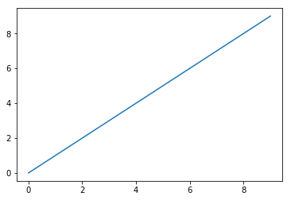

---
{
  "title": "test notebook 1",
  "subtitle": "Generic subtitle",
  "date": "2018-04-02",
  "slug": "test-notebook-1"
}
---
<!--more-->


```python
import numpy as np
import matplotlib.pyplot as plt
%matplotlib inline
```

```python
x = np.arange(0,10)
y = np.arange(0,10)
```

```python
plt.plot(x,y)
```

    [<matplotlib.lines.Line2D at 0x10f77cf28>]




