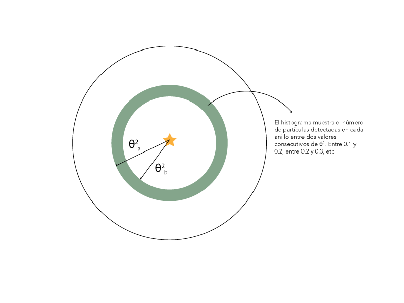
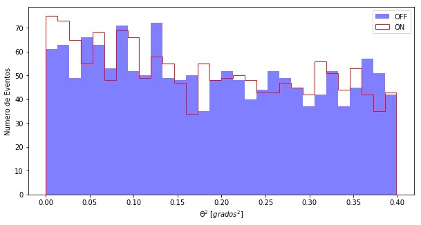

```python
%matplotlib inline
from noche1_4 import *
```
# Les nostres primeres dades

Ara ja tenim dades de raigs Gamma de veritat.
- En el fitxer **casa** tenim les dades ON (recordes?)
- En el fitxer **off** tenim les dades OFF

Recordes com llegir les dades?

```
leer("casa"),...
```

Mirem quina pinta tenen. Recorda que el primer és entendre el format de les dades.


```python
leer("casa")
leer("off")
```

    theta2
    ------
     0.038
     0.288
     0.275
     0.091
     0.141
     0.324
     0.113
      0.06
     0.088
      0.25
       ...
     0.128
     0.335
     0.316
     0.016
      0.33
     0.125
     0.283
     0.263
     0.012
     0.001
      0.37
    Length = 1556 rows
    theta2
    ------
     0.279
      0.08
     0.011
     0.372
     0.107
     0.148
     0.023
     0.308
     0.396
     0.097
       ...
     0.053
     0.225
     0.055
     0.368
     0.268
     0.068
     0.117
     0.192
      0.37
      0.28
      0.24
    Length = 1523 rows


Només hi ha una columna que es diu **theta2**.

Fixa't que en aquests arxius només tinc un valor per gamma detectat ... en diem Theta quadrat, de la lletra grega. **Theta2** indica la distància entre el punt del cel d'on venia la partícula que hem detectat i la font que estic observant, és a dir, CasA per les dades ON, i un lloc buit pels OFF.

Per entendre aquestes dades el millor és representar-los. Farem una gràfica que es diu **histograma**, que mostra el nombre de deteccions en cada rang de **Theta2**. Mira aquest dibuix:


Mostrem els histogrames de CasA i OFF:


```python
histograma("casa")
histograma("off")
```


Per poder comparar el millor és pintar els dos histogrames alhora:


```python
histograma("casa", "off")
```




A vegades guanya l'OFF i de vegades guanya l'ON. Prop del 0.00, que és on està CasA, sembla que guanya l'ON, no? Però no podem estar segurs.

La veritat és que amb només 3 hores d'observació poc més podem fer. Necessitem moltes més hores per poder caçar més gammes i estar segurs que CasA és una font de raigs gamma.

Així que a observar, a caçar Gammas i després a analitzar-los!
