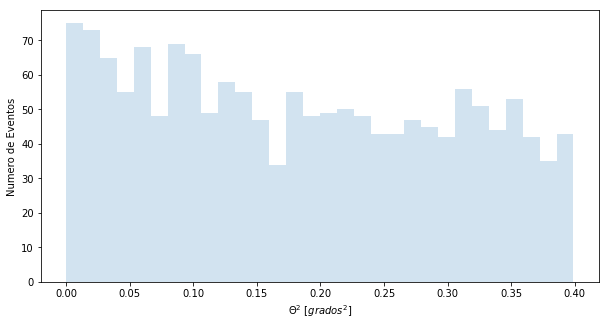

```python
%matplotlib inline
from noche1_4 import *
```

# Our first data

Now we have real Gamma ray data.
- In the file **casa** we have the ON data (remember?)
- In the file **off** we have the data OFF

Do you remember how to read the data?

```
leer("casa"),...
```
Let's see what they look like. Remember that the first thing is to understand the format of the data.


```python
leer("casa")
leer("off")
```

    theta2
    ------
     0.038
     0.288
     0.275
     0.091
     0.141
     0.324
     0.113
      0.06
     0.088
      0.25
       ...
     0.128
     0.335
     0.316
     0.016
      0.33
     0.125
     0.283
     0.263
     0.012
     0.001
      0.37
    Length = 1556 rows
    theta2
    ------
     0.279
      0.08
     0.011
     0.372
     0.107
     0.148
     0.023
     0.308
     0.396
     0.097
       ...
     0.053
     0.225
     0.055
     0.368
     0.268
     0.068
     0.117
     0.192
      0.37
      0.28
      0.24
    Length = 1523 rows


There is only one column called **theta2**.

Notice that in these files I only have one value per gamma detected ... we call it Theta square, from the Greek letter. **Theta2** indicates the distance between the point of the sky from where the particle we have detected came and the source that I am observing. That isi, CasA for the ON data and an empty site for the OFF.

To understand these data, it is best to represent them. We will make a graph called **histogram**, which shows the number of detections in each range of **Theta2**. Look at this drawing:


Let's show the CasA and OFF histograms:


```python
histograma("casa")
histograma("off")
```





To be able to compare, it is best to paint the two histograms at the same time:


```python
histograma("casa", "off")
```


Sometimes OFF wins and sometimes ON wins.
Near 0.00, which is where CasA is, it seems that the ON wins, right? But we can not be sure.

The truth is that with only 3 hours of observation we can do little more. We need many more hours to be able to catch more gammas and be sure that CasA is a source of Gamma rays.
