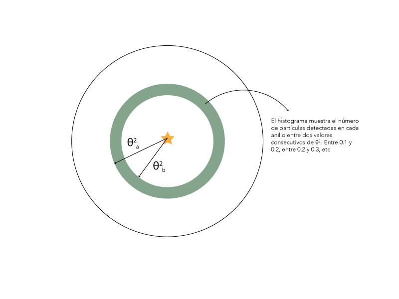
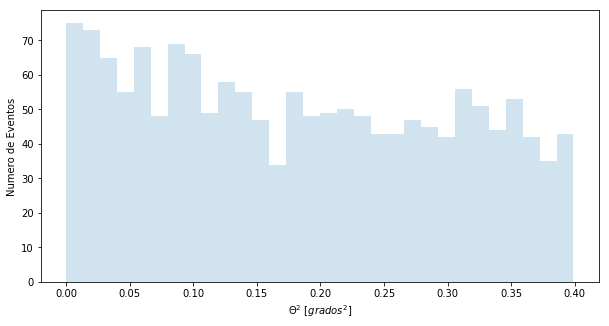
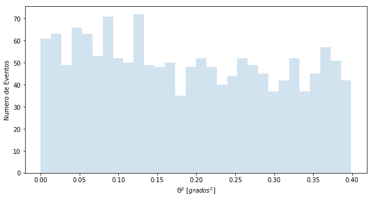
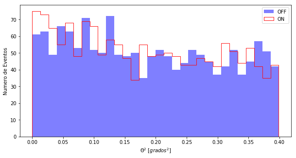

+++
title = "Notebook 1-4"
description = ""
date = "2018-03-31"
slug = ""
type = "notebook"
notebook = "night_1_4.ipynb"
+++

```python
%matplotlib inline
from noche1_4 import *
```

# Nuestros primeros datos

Ahora ya tenemos datos de rayos Gamma de verdad.
- En el fichero **casa** tenemos los datos ON (¿recuerdas?)
- En el fichero **off** tenemos los datos OFF

¿Recuerdas cómo leer los datos?

```
leer("casa"),...
```

Miremos qué pinta tienen. Recuerda que lo primero es entender el formato de los datos.


```python
leer("casa")
leer("off")
```

    theta2
    ------
     0.038
     0.288
     0.275
     0.091
     0.141
     0.324
     0.113
      0.06
     0.088
      0.25
       ...
     0.128
     0.335
     0.316
     0.016
      0.33
     0.125
     0.283
     0.263
     0.012
     0.001
      0.37
    Length = 1556 rows
    theta2
    ------
     0.279
      0.08
     0.011
     0.372
     0.107
     0.148
     0.023
     0.308
     0.396
     0.097
       ...
     0.053
     0.225
     0.055
     0.368
     0.268
     0.068
     0.117
     0.192
      0.37
      0.28
      0.24
    Length = 1523 rows


Solo hay una columna que se llama **theta2**.

Fíjate que en estos archivos sólo tengo un valor por gamma detectado... le llamamos Theta cuadrado, de la letra griega. **Theta2** indica la distancia entre el punto del cielo de donde venía la partícula que hemos detectado y la fuente que estoy observando, es decir, CasA para los datos ON, y un sitio vacio para los OFF.

Para entender estos datos lo mejor es representarlos. Haremos una gráfica que se llama **histograma**, que muestra el número de detecciones en cada rango de **Theta2**. Mira este dibujo:


Mostremos los histogramas de CasA y OFF:


```python
histograma("casa")
histograma("off")
```








Para poder comparar lo mejor es pintar los dos histogramas a la vez:


```python
histograma("casa", "off")
```





A veces gana el OFF y a veces gana el ON.
Cerca del 0.00, que es donde está CasA, parece que gana el ON, ¿no? Pero no podemos estar seguros.

La verdad es que con solo 3 horas de observación poco más podemos hacer. Necesitamos muchas más horas para poder cazar más gammas y estar seguros de que CasA es una fuente de rayos Gamma.

Así que ¡a observar, a cazar Gammas y luego a analizarlos!
