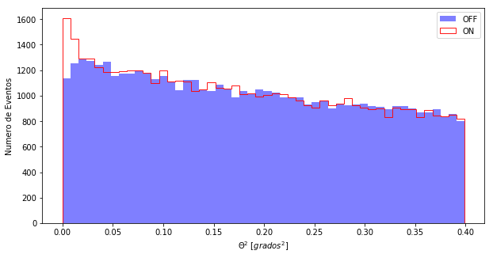
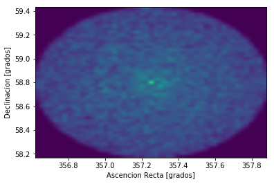
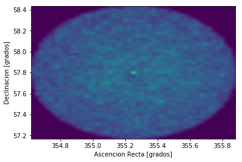
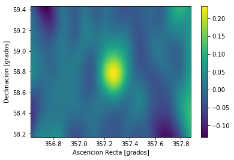

```python
%matplotlib inline
from noche1_5 import *
```

# Prou tanta PACIÈNCIA !!

3 hores d'observació és molt poc per a un caçador de raigs Gamma.
100 hores ja és alguna cosa més raonable. De Gammas n'hi ha pocs i hem de tenir paciència, però ja n'hem tingut prou. Anem a veure què tenim a les nostres dades.

Aquí tenim les dades de 100 hores d'observació: **casa** i **off**. Vols veure-les?
Recorda les instruccions que hem fet servir abans:

> - Per representar **histograma("casa")** o "off"
> - I per veure'ls junts **histograma("casa", "off")**


```python
histograma("casa","off")
```





Fixa't bé, de nou, en els eixos, les escales i després les dades. Què passa prop del valor **0.00**? Hi ha més o menys diferència entre les barres del ON i l'OFF? ¿I a la resta de valors de theta2?

Sembla que amb 100 hores va quedant clar que del centre del nostre camp de visió estan arribant bastants més gammas que d'un punt qualsevol del cel. **Està clar que CasA emet Raigs Gamma**.

**I els hem caçat nosaltres!**

Hi ha altres maneres de representar aquestes dades. És el que anomenem el **skymap, un mapa del cel Gamma**.
El que fem és mostrar en dues dimensions d'on venen els raigs Gamma que cacem amb els MAGIC.
L'histograma anterior és una representació en 1 sola dimensió.

Fixa't en els fitxers que tenim ara. Contenen més informació que abans:


```python
leer("casa")
leer("off")
```

    theta2    RA     DEC
    ------ ------- -------
     0.018 357.355 58.7168
     0.185 357.535 59.1217
     0.155 357.197 59.1901
     0.217 356.827 58.9941
     0.082 357.536 58.8118
     0.335 356.937 59.2868
     0.344 356.992 59.3269
     0.273  357.28 59.3216
      0.06 357.044 58.9332
     0.298 356.712 58.7082
       ...     ...     ...
     0.054 357.052 58.6787
     0.103 356.999 59.0005
     0.286 356.718 58.7462
     0.256 357.691 58.5512
     0.327 356.732  59.043
      0.16 356.908 59.0071
     0.092 356.955 58.8698
     0.366 357.705 58.4009
     0.082 357.302 58.5184
     0.132 357.312 59.1581
     0.024 357.106 58.7426
    Length = 51908 rows
    theta2    RA     DEC
    ------ ------- -------
     0.194 355.596  57.527
      0.22 355.561 58.1508
     0.245 355.183 58.2904
     0.152 354.896 57.9624
     0.356 355.846 57.8246
     0.259 354.975  58.228
     0.096 355.114 58.0783
     0.077 355.266  58.077
     0.068 355.031 57.9418
     0.234 354.773 57.7186
       ...     ...     ...
     0.205 355.592 57.5033
     0.257 355.756 57.8295
     0.307 355.209 58.3525
     0.109 355.523 57.9863
     0.326 355.104  58.352
     0.198 355.454 57.4044
     0.385 355.398 58.4025
      0.15 355.631 57.8698
     0.009 355.306 57.8769
     0.044 355.212 58.0063
     0.277  355.38   57.29
    Length = 51406 rows


---------
Ara hi ha dues columnes noves:
- RA indica l'ascensió recta de la partícula detectada
- DEC indica la declinació de la partícula detectada

Totes dues són coordenades que situen les deteccions al cel. Així que podríem fer un histograma en dues dimensions tenint en compte RA i DEC.

Això és justament el skymap:


```python
skymap("casa")
skymap("off")
```








Tracta de comparar els dos skymaps, el de CasA i el de l'OFF.
Difícil veure la diferència així per separat, no?

-----------------

La manera de veure alguna cosa és **restar ON-OFF i dividir per OFF**, fem el skymap amb aquesta operació:


```python
skymap("casa","off")
```




Aquí està, el punt vermell al centre ... sí, no és tan bonica com les imatges de ràdio, però aquests
raigs són molt més energètics ... això és el **Univers Extrem**.
