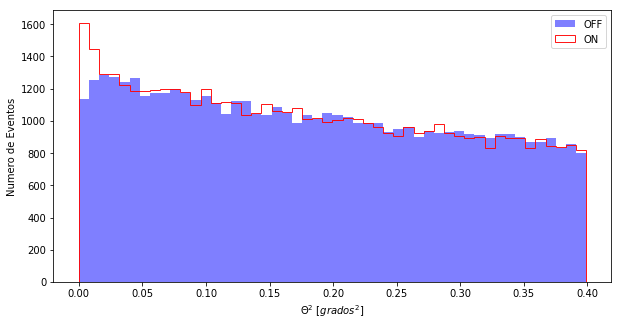
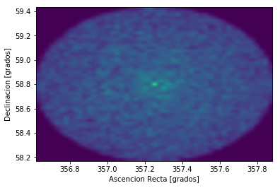
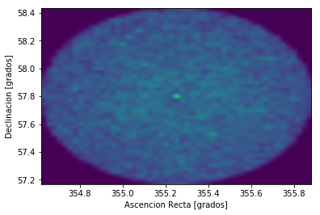
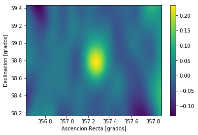

```python
%matplotlib inline
from noche1_5 import *
```

# Enough PATIENCE !!

3 hours of observation is very little for a Gamma ray hunter.
100 hours is already something more reasonable. Gammas are few and we must have patience, but we have had enough. Let's see what we have in our data.

Here we have the data of 100 hours of observation: **casa** and **off**. Do you want to see them?
Remember the instructions we used before:

> - To represent them **histograma("casa")** or "off"
> - And to see them together **histograma("casa", "off")**


```python
histograma("casa","off")
```





Look carefully, again, at the axes, the scales and then the data. What happens near the value **0.00**? Is there more or less difference between the ON and OFF bars? And in the rest of theta2 values?

It seems that with 100 hours it is becoming clear that from the center of our field of vision are arriving more gammas than from any point of the sky. **It is clear that CasA emits Gamma Rays**.

**And we have hunted them!**

There are other ways to represent this data. It is what we call the **skymap, a map of the Gamma sky**.
What we do is to show in two dimensions where the Gamma rays that we hunt with the MAGIC come from.
The previous histogram is a representation in 1 single dimension.

Look at the files we have now. They contain more information than before:


```python
leer("casa")
leer("off")
```

    theta2    RA     DEC
    ------ ------- -------
     0.018 357.355 58.7168
     0.185 357.535 59.1217
     0.155 357.197 59.1901
     0.217 356.827 58.9941
     0.082 357.536 58.8118
     0.335 356.937 59.2868
     0.344 356.992 59.3269
     0.273  357.28 59.3216
      0.06 357.044 58.9332
     0.298 356.712 58.7082
       ...     ...     ...
     0.054 357.052 58.6787
     0.103 356.999 59.0005
     0.286 356.718 58.7462
     0.256 357.691 58.5512
     0.327 356.732  59.043
      0.16 356.908 59.0071
     0.092 356.955 58.8698
     0.366 357.705 58.4009
     0.082 357.302 58.5184
     0.132 357.312 59.1581
     0.024 357.106 58.7426
    Length = 51908 rows
    theta2    RA     DEC
    ------ ------- -------
     0.194 355.596  57.527
      0.22 355.561 58.1508
     0.245 355.183 58.2904
     0.152 354.896 57.9624
     0.356 355.846 57.8246
     0.259 354.975  58.228
     0.096 355.114 58.0783
     0.077 355.266  58.077
     0.068 355.031 57.9418
     0.234 354.773 57.7186
       ...     ...     ...
     0.205 355.592 57.5033
     0.257 355.756 57.8295
     0.307 355.209 58.3525
     0.109 355.523 57.9863
     0.326 355.104  58.352
     0.198 355.454 57.4044
     0.385 355.398 58.4025
      0.15 355.631 57.8698
     0.009 355.306 57.8769
     0.044 355.212 58.0063
     0.277  355.38   57.29
    Length = 51406 rows


---------
Now there are two new columns:
- RA indicates the straight ascension of the detected particle
- DEC indicates the declination of the detected particle

Both are coordinates that place the detections in the sky. So you could do a histogram in two dimensions taking in ditch RA and DEC.

That's exactly the skymap:


```python
skymap("casa")
skymap("off")
```








Try to compare the two skymaps, CasA and OFF.
Difficult to see the difference like that separately, right?

-----------------

The way to see something is to **subtract ON-OFF and divide it by OFF**, let's do the skymap with this operation:


```python
skymap("casa","off")
```




There it is, the red dot in the center ... yes, it's not as pretty as the radio images, but these
rays are much more energetic ... this is the **Extreme Universe**.
