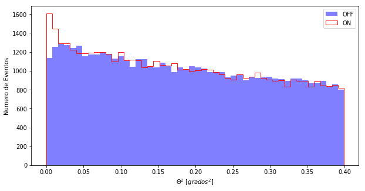
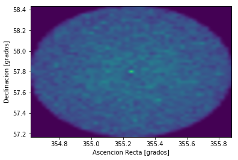
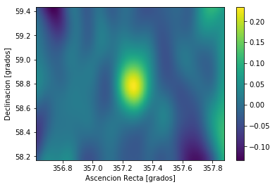

```python
%matplotlib inline
from noche1_5 import *
```

# ¡¡Basta tanta PACIENCIA!!

3 horas de observación es muy poco para un cazador de rayos Gamma.
100 horas ya es algo más razonable. Gammas hay pocos y debemos tener paciencia, pero ya hemos tenido suficiente. Vamos a ver qué tenemos en nuestros datos.

Aquí tenemos los datos de 100 horas de observación: **casa** y **off**. ¿Quieres verlos?
Recuerda las instrucciones que usamos antes:

> - Para representarlos **histograma("casa")** o "off"
> - Y para verlos juntos **histograma("casa", "off")**


```python
histograma("casa","off")
```





Fíjate bien, de nuevo, en los ejes, las escalas y luego los datos. ¿Qué pasa cerca del valor **0.00**? ¿Hay más o menos diferencia entre las barras del ON y del OFF? ¿Y en el resto de valores de theta2?

Parece que con 100 horas va quedando claro que del centro de nuestro campo de visión están llegando bastantes más gammas que de un punto cualquiera del cielo. **Está claro que CasA emite Rayos Gamma**.

**¡Y los hemos cazado nosotros!**

Hay otras maneras de representar estos datos. Es lo que llamamos el **skymap, un mapa del cielo Gamma**.
Lo que hacemos es mostrar en dos dimensiones de dónde vienen los rayos Gamma que cazamos con los MAGIC.
El histograma anterior es una representación en 1 sola dimensión.

Fíjate en los ficheros que tenemos ahora. Contienen más información que antes:


```python
leer("casa")
leer("off")
```

    theta2    RA     DEC
    ------ ------- -------
     0.018 357.355 58.7168
     0.185 357.535 59.1217
     0.155 357.197 59.1901
     0.217 356.827 58.9941
     0.082 357.536 58.8118
     0.335 356.937 59.2868
     0.344 356.992 59.3269
     0.273  357.28 59.3216
      0.06 357.044 58.9332
     0.298 356.712 58.7082
       ...     ...     ...
     0.054 357.052 58.6787
     0.103 356.999 59.0005
     0.286 356.718 58.7462
     0.256 357.691 58.5512
     0.327 356.732  59.043
      0.16 356.908 59.0071
     0.092 356.955 58.8698
     0.366 357.705 58.4009
     0.082 357.302 58.5184
     0.132 357.312 59.1581
     0.024 357.106 58.7426
    Length = 51908 rows
    theta2    RA     DEC
    ------ ------- -------
     0.194 355.596  57.527
      0.22 355.561 58.1508
     0.245 355.183 58.2904
     0.152 354.896 57.9624
     0.356 355.846 57.8246
     0.259 354.975  58.228
     0.096 355.114 58.0783
     0.077 355.266  58.077
     0.068 355.031 57.9418
     0.234 354.773 57.7186
       ...     ...     ...
     0.205 355.592 57.5033
     0.257 355.756 57.8295
     0.307 355.209 58.3525
     0.109 355.523 57.9863
     0.326 355.104  58.352
     0.198 355.454 57.4044
     0.385 355.398 58.4025
      0.15 355.631 57.8698
     0.009 355.306 57.8769
     0.044 355.212 58.0063
     0.277  355.38   57.29
    Length = 51406 rows


---------
Ahora hay dos columnas nuevas:
- RA indica la ascensión recta de la partícula detectada
- DEC indica la declinación de la partícula detectada

Ambos son coordenadas que sitúan las detecciones en el cielo. Así que podríamois hacer un histograma en dos dimensiones teniendo en cuneta RA y DEC.

Eso es justamente el skymap:


```python
skymap("casa")
skymap("off")
```





Trata de comparar los dos skymaps, el de CasA y el del OFF.
Difícil ver la diferencia así por separado, ¿no?

-----------------

La manera de ver algo es **restar ON-OFF y dividirlo por OFF**, hagamos el skymap con esta operación:


```python
skymap("casa","off")
```





Ahí está, el punto rojo en el centro ... sí, no es tan bonita como las imagenes de radio, pero estos
rayos son mucho mas energéticos ... esto es el **Universo Extremo**.
