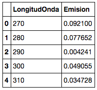

```python
import pandas as pd
import matplotlib.pyplot as pl
from Theta2ConCorteHadronness import *
%matplotlib inline
```

# Buscant senyal a Cyg-X1 
Aquí tenim les dades de **Cyg-X1** ... vegem com hi busquem senyal 

El primer és llegir les dades que hem pres. Veig que el Daniel utilitzavava una funció que s'ha creat ell sense explicar molt que fa realment ... això està bé per començar, però potser ja és hora de veure que hi ha dins de la funció: 
Quan el Daniel fa **leer("luna")**, el que fa en realitat és:

> **luna=pd.read_csv("EmisionLuna.txt", , sep=' ')**

I amb això crea una variable **luna** que té tota informació que hi ha al fitxer "EmisionLuna.txt".



Hi ha 3 columnes i diverses files. Aquí només veiem les 5 primeres.
Si volem fer servir les dades de la **longitud de onda**, els trobem aquí:

> **luna.LongituOnda**

Si volem els us dades de la **Emision**, els trobem aquí:
> **luna.Emision**

iLa primera columna és un índex. Com el que hi ha en un Excel, per exemple.

Per veure les primeres 5 files del fitxer podem fer:
>**luna.head(5)**

Per veure quantes files hi ha en les dades podem fer:
>**len(luna)**

----------
Vegem com ho fem amb les meves dades de CygX1. Primer llegirem els arxius que contenen els esdeveniments per ON i OFF (recordeu què és ON i OFF, no?)


```python
#Llegim els fitxers i els hi donem un nom
cygX1_ON= pd.read_csv('data/EvtList_ON_CygX3_1day.txt', sep=' ')
cygX1_OFF= pd.read_csv('data/EvtList_OFF_CygX3_1day.txt', sep=' ')
```

Ara sé que els valors de **Theta cuadrado** per les meves dades ON i OFF els trobo així:

> **cygX1_ON.theta2
> cygX1_OFF.theta2**


```python
# Mirem quin aspecte tenen els 5 primers valors de theta2 del ON, per exemple
cygX1_ON
cygX1_ON.theta2.head(5)

```


    0    0.149
    1    0.178
    2    0.011
    3    0.020
    4    0.317
    Name: theta2, dtype: float64


```python
# I també quantes files té el fitxer 
len(cygX1_ON)
```


    32654

Més de 30 mil esdeveniments detectats pel telescopi. Això no és cap joc!
Encara que mirar les dades així no serveix per a molt. El que hem de fer és representar-les gràficament.

--------
Ara que hi penso, el Daniel tampoc us ha mostrat com fer el famós **Theta Plot**, quan el vegi li caurà una bronca de les bones.

Res, fem-ho ... en lloc de fer el simple **histograma ("casa", "off")** s'han de donar alguns passos més:

1. Definir la mida i els colors de l'espai on farem el gràfic
2. Fer el gràfic de barres per al ON (**cygX1_ON.theta2**) i l'OFF (**cygX1_OFF.theta2**)
3. Posar nom als eixos
4. Mostra el gràfic

Vegem com es fa:


```python
# 1 Definir espai de la figura
pl.figure(1, figsize=(10, 5), facecolor='w', edgecolor='k')
# 2 Gràfic de barres ... cygX1_OFF.theta2 i cygX1_ON.theta2 és on tinc els valors
# que cal representar, la resta és cosmètica dels gràfics, no li doneu
# importància per ara
pl.hist(cygX1_OFF.theta2, bins=30, histtype='stepfilled',alpha=0.5, color='red', normed=False)
pl.hist(cygX1_ON.theta2, bins=30, histtype='step',alpha=0.9, color = 'blue', normed=False)
# 3 Nom per als eixos
pl.xlabel('$\Theta^2$ [$grados^2$]')
pl.ylabel('Numero de Eventos')
# 4 A mostrar el gràfic ...
pl.show()
```


Aquí no hi ha res ... però és que el Daniel us ha fet trampes no només amb el codi, sinó també amb l'anàlisi.

Un dels grans problemes dels **Caçadors de Raigs Gamma**, és que a més d'arribar-nos raigs gamma, ens arriben nuclis d'àtoms (majoritàriament protons). Així que per veure alguna cosa necessitem treure'ns de sobre aquests altres rajos.

Mira com queda el **Theta Plot** quan em trec de sobre els protons:

```python
from Theta2ConCorteHadronness import *
Non, Noff = histograma_hadronness(0.20)
```


Ara sóc jo qui fa trampes i no us ensenyo com em quedo només amb esdeveniments amb hadronness petit, :D.

Però no em digueu que no queda bonic el gràfic. Podeu veure que hi ha molts menys esdeveniments que abans i que ... ***HI HA SENYAL !!!***

Vegem quina **significancia** té aquest senyal: 


```python
from Significancia import *
CalcularSignificancia(Non, Noff)
```

    2.6845929556404116

No està malament, 2.7 sigma pel tall de 0.20 ... Què vol dir això? Segueix una estona més amb mi i t'ho intento explicar.
