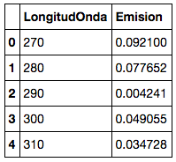
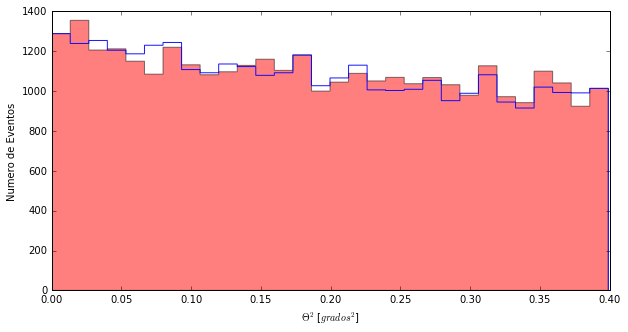
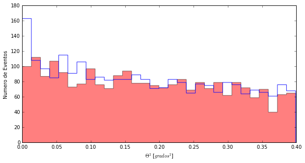

```python
import pandas as pd
import matplotlib.pyplot as pl
from Theta2ConCorteHadronness import *
%matplotlib inline
```

# Looking for signal in Cyg-X1
Here we have the data of **Cyg-X1** ... let's see how we look for a signal in them

The first thing is to read the data we have taken. I see that Daniel used a function that he created without explaining much what he really does ... that's fine to start with, but maybe it's time to see what's inside the function:
When Daniel does **leer("luna")**, what he actually does is:

> **luna=pd.read_csv("EmisionLuna.txt", , sep=' ')**

And with this it creates a variable **luna** that has all the information that there is in the file "EmisionLuna.txt".



There are 3 columns and several rows. Here we only see the first 5.
If we want to use the data of the **longitud de onda**, we find them here:
> **luna.LongituOnda**

If we want the data of the **Emision**, we find them here:
> **luna.Emision**

The first column is an index. Like the one in an Excel, for example.

To see the first 5 rows of the file we can do:
>**luna.head(5)**

To see how many rows there are in the data we can do:
>**len(luna)**

----------
Let's see how we do it with my CygX1 data. First let's read the files that contain the events for ON and OFF (you remember what is ON and OFF, right?)

```python
#We read the files and give them a name
cygX1_ON= pd.read_csv('data/EvtList_ON_CygX3_1day.txt', sep=' ')
cygX1_OFF= pd.read_csv('data/EvtList_OFF_CygX3_1day.txt', sep=' ')
```


Now I know that the values of **Theta cuadrado** for my ON and OFF data I find them like this:

> **cygX1_ON.theta2
> cygX1_OFF.theta2**


```python
# We look at what the first 5 values of theta2 of the ON look like, for example
cygX1_ON
cygX1_ON.theta2.head(5)

```


    0    0.149
    1    0.178
    2    0.011
    3    0.020
    4    0.317
    Name: theta2, dtype: float64


```python
# And also how many rows does the file have
len(cygX1_ON)
```


    32654


More than 30 thousand events detected by the telescope. This is not a game!
Although looking at the data like that does not help much. What we have to do is represent them graphically.

--------
Now that I think about it, Daniel has not shown you how to make the famous **Theta Plot**, when I see him I give him a good fight.

Nothing, let's do it ... instead of doing the simple ** histogram ("home", "off") ** you have to take a few more steps:

1. Define the size and colors of the space where we will make the graph
2. Make the bar graph for ON (** cygX1_ON.theta2 **) and OFF (** cygX1_OFF.theta2 **)
3. Name the axes
4. Show the graph

Let's see how it is done:

```python
# 1 Define figure space
pl.figure(1, figsize=(10, 5), facecolor='w', edgecolor='k')
# 2 Bar graph ... cygX1_OFF.theta2 and cygX1_ON.theta2 is where I have the values
# that you have to represent, the rest is cosmetic graphics, do not give it
# importance for now
pl.hist(cygX1_OFF.theta2, bins=30, histtype='stepfilled',alpha=0.5, color='red', normed=False)
pl.hist(cygX1_ON.theta2, bins=30, histtype='step',alpha=0.9, color = 'blue', normed=False)
# 3 Name for the axes
pl.xlabel('$\Theta^2$ [$grados^2$]')
pl.ylabel('Numero de Eventos')
# 4 To show the graph ...
pl.show()
```




There's nothing here ... but Daniel has cheated you not only with the code, but also with the 
analysis

One of the bigest problems of the **Gamma Ray Hunters**, is that in addition to the gamma rays,
nuclei of atoms arrive to us (mainly protons). So to see something we need to get rid of
these other rays.

See how the **Theta Plot** looks when I take off the protons:

```python
from Theta2ConCorteHadronness import *
Non, Noff = histograma_hadronness(0.20)
```





Now I'm the one who cheats and I do not teach you how I'm left alone with events with small hadronness,: D.

But do not tell me that the graphic is not pretty. You can see that there are many fewer events than before and that ... ***THERE IS SIGNAL !!!***

Let's see what **significance** has this signal:

```python
from Significancia import *
CalcularSignificancia(Non, Noff)
```

    2.6845929556404116

Not bad, 2.7 sigma for the cut of 0.20 ... What does this mean? Follow me for a while and I'll try to explain it to you.
