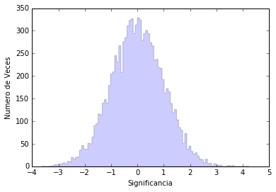
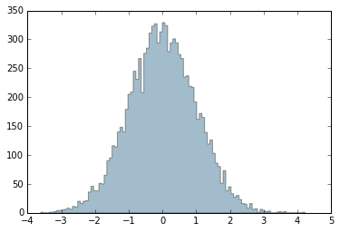

# La maledicció de les 3 sigmes

A veure si veiem què volen dir les 2.7 sigmes que hem aconseguit.

Com de costum, comencem carregant les llibreries necessàries

 

```python
import numpy as np
from SimularBackground import *
%matplotlib inline
```

M'he creat una funció que simula 10000 Obsevacions per a les quals no hi ha senyal. El nombre esperat d'esdeveniments per les observacions ON i OFF són els mateixos. Això no vol dir que sempre tinguem el mateix nombre d'esdeveniments per ON i OFF. És com quan tires dos daus, el valor mitjà esperat de la suma dels dos daus és 7, però això no vol dir que a vegades no sumin a 2 o 12.

Per a cadascuna d'aquestes observacions simulades (que trigaria una vida sencera dedicada només a elles per fer-les de veritat!), Em càlcul.lo **Significancia** que es dóna en unitats de **sigmes**.


```python
grafica("Significancias")
```




La part negativa de la distribució és per als casos en què hi ha més esdeveniments a les observacions OFF que en les ON, cosa que no té molt sentit físic. Simplement passa pel que anomenem fluctuacions estadístiques. La part positiva de la distribució en aquest cas també són fluctuacions estadísiticas per construcció. Però en observacions reals com la que estem analitzant de Cyg-X1 no es pot distingir entre una fluctuació estadística o senyal de veritat.

Això si, com més **sigmes** téla nostra **significança** menys probable és que sigui una fluctuació estadística. Es pot veure en el gràfic que la quantitat de vegades que tinc un cert valor de **sigmes** decreix quan creix **sigma**.

De fet anem a calcular quina és la probabilitat de tenir una fluctuació estadística que em doni una significança més gran que la que tenim amb les dades de Cyg-X1.


```python
# Primer recupero del gràfic les "Vegades" que tinc cada "Significacancia"
# Ho faig amb un parell de funcions que m'he creat
Veces=valores("Numero de Veces")
Significancias=valores("Significancias")

# Ara faig servir una funció de la llibreria que he carregat NumPy que per a cada bin em suma
# Els valors de tots els bins anteriors. Per exemple pas de (3,6,0,4,1) a (3,9,9,13,14)
VecesAcumuladas = np.cumsum(Veces)
# I amb això és fàcil calcular la fracció de vegades que tinc una significança major
# Que qualsevol valor. Primer càlcul la probabilitat per a cadascuns dels valors
# De sigma en el gràfic
Probabilidad = 1.0-VecesAcumuladas/(VecesAcumuladas.max())
# I finalment faig servir un bucle (for x in range (0.100)) per al qual x va canviant de
# Valor des de 0 fins 100 i miro quan el valor de la significació és més gran que 2.68
# I allà tindré el meu probabilitat:
for x in range(0,100):
        if Significancias[x] > 2.68 :
                print ("La probabilitat que el soroll no generi una significancia de 2.68 o major és:", Probabilidad[x]*100, "%")
                break
```

    La probabilitat que el soroll no generi una significancia de 2.68 o major és: 0,22%




Estem d'acord, una probabilitat del 0,22% és bastant petita. Però no prou. Els científics ens volem assegurar que el que estem veient és cert. Per estar segurs que no són fluctuacions estadístiques el camp científic normalment requereix que la **Significancia** sigui de **5 sigmes**. Això és una probabilitat d'0.000025%

> Nota: Definir funcions ens ajuda a anar pas a pas, però si teniu curiositat per saber què està definit en les funcions, no dubtis a fer servir el fòrum per preguntar.

