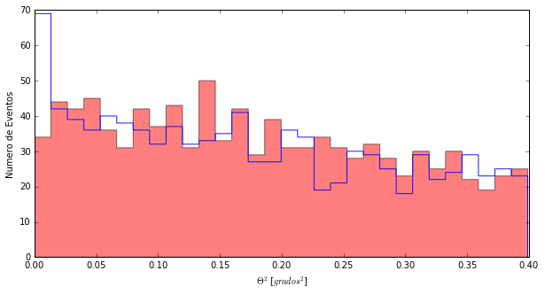
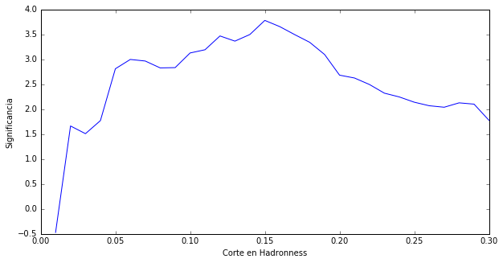
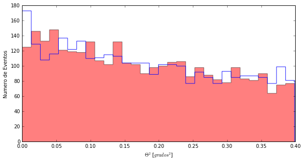

# Mirem totes les dades

Un cop més ... ja saps com vam començar, no?

```python
import pandas as pd
import matplotlib.pyplot as pl
from Significancia import *
%matplotlib inline
```

I ara, una cosa que ja sabem fer. Llegim els fitxers amb totes les dades i els valors que hi ha en les seves columnes. I aquesta vegada, llegim no solament el valor de **Theta Quadrat**, sinó també el de **hadronness** que són els valors que hi ha a la columna que es diu **had**


```python
#Llegim els fitxers i els hi donem un nom
cygX1_ON= pd.read_csv('data/EvtList_ON_CygX3_All.txt', sep=' ')
cygX1_OFF= pd.read_csv('data/EvtList_OFF_CygX3_All.txt', sep=' ')

#Mirem quantes files estem carregant a les dades
len(cygX1_ON)
```


    84597


```python
#Mirem com són les dades de l'ON, per exemple
cygX1_ON.head()
```


<div>
<table border="1" class="dataframe">
  <thead>
    <tr style="text-align: right;">
      <th></th>
      <th>had</th>
      <th>theta2</th>
    </tr>
  </thead>
  <tbody>
    <tr>
      <th>0</th>
      <td>1.000</td>
      <td>0.149</td>
    </tr>
    <tr>
      <th>1</th>
      <td>0.126</td>
      <td>0.178</td>
    </tr>
    <tr>
      <th>2</th>
      <td>1.000</td>
      <td>0.011</td>
    </tr>
    <tr>
      <th>3</th>
      <td>0.970</td>
      <td>0.020</td>
    </tr>
    <tr>
      <th>4</th>
      <td>0.995</td>
      <td>0.317</td>
    </tr>
  </tbody>
</table>
</div>

Veus la columna anomenada **had**? Aquí està la informació del hadroness de cada esdeveniment detectat pel telescopi. Alguns tenen **hadroness alt** (1.000, 0.970), són probablement protons o nuclis lleugers. Altres tenen **hadroness baix**, això són probablement els gammas que busquem.

Amb més de vuitanta mil files, el millor que podem fer és representar les dades amb un **Theta Plot**. Però no volem totes les files, només ens quedarem amb aquelles que tinguin **hadroness menor que 0.20**

1. Definim la variable **had_cut = 0.20**
2. Seleccionem únicament les files que tenen **hadroness <had_cut** i les guardem amb el nom **CygX1_ON_cut**:
> **cygX1_ON_cut = cygX1_ON [cygX1_ON ['had'] <had_cut]**
> CygX1_ON_cut té menys files que CygX1_ON, però el mateix nombre de columnes. Sabries comporbar-ho?
3. Faig el **Theta Plot** igual que sense el tall en hadronnes però ara fem servir **CygX1_ON_cut.theta2**
4. I el mateix per a l'OFF, així la comparació té sentit.


```python
# 1  Definim la variable had_cut
had_cut = 0.20
# 2 eleccionem les dades: hadroness menor que 0.20
cygX1_ON_cut = cygX1_ON[cygX1_ON['had'] < had_cut]
cygX1_OFF_cut = cygX1_OFF[cygX1_OFF['had'] < had_cut]
# 3 Fem el Theta Plot
pl.figure(1, figsize=(10, 5), facecolor='w', edgecolor='k')
Noff, ThetasOff, _ = pl.hist(cygX1_OFF_cut.theta2, bins=30, histtype='stepfilled', color='red', alpha=0.5, normed=False)
Non, ThetasOn, _ = pl.hist(cygX1_ON_cut.theta2, bins=30, histtype='step', color = 'blue',alpha=0.9, normed=False)
pl.xlabel('$\Theta^2$ [$grados^2$]')
pl.ylabel('Numero de Eventos')
pl.show()
CalcularSignificancia(Non, Noff)
```


    -0.48949852089254597


És cert, he fet alguna cosa diferent. Davant de la instrucció:
> "pl.hist(CutHad.compressed(), bins=30, histtype='step', color = 'blue',alpha=0.9, normed=False)"

he posat:

> Non, ThetasOn, _ =

Això em permet guardar el nombre d'esdeveniments que hi ha a cada barra del gràfic en Non i el valor de **Theta Quadrat** que representa aquesta barra a ThetasOn.

I llavors utilitzo Non i Noff per calcular la significança i ...

Res de res, ja es veu al gràfic. Amb totes les dades no hi ha senyal i la significança és -0.49 sigmes.

---------

I què passa si canviem el tall en hadronness? De fet si en lloc de 0.20 tallo a 0.06 recupero les sigmes que tenia.

```python
# 1 Definim la variable had_cut
had_cut = 0.06
# 2 Seleccionem les dades: hadroness menor que 0.06
cygX1_ON_cut = cygX1_ON[cygX1_ON['had'] < had_cut]
cygX1_OFF_cut = cygX1_OFF[cygX1_OFF['had'] < had_cut]
# 3 Fem el Theta Plot

pl.figure(1, figsize=(10, 5), facecolor='w', edgecolor='k')
Noff, ThetasOff, _ = pl.hist(cygX1_OFF_cut.theta2, bins=30, histtype='stepfilled', color='red', alpha=0.5, normed=False)
Non, ThetasOn, _ = pl.hist(cygX1_ON_cut.theta2, bins=30, histtype='step', color = 'blue',alpha=0.9, normed=False)
pl.xlabel('$\Theta^2$ [$grados^2$]')
pl.ylabel('Numero de Eventos')
pl.show()
CalcularSignificancia(Non, Noff)
```





    2.4003967925959162


**"Trial factors", "Trial factors", "Trial factors", "Trial factors", "Trial factors"**

Sí, sí ... aquí està la meva veu de la consciència que de tant treballar en un entorn internacional ja em parla en anglès. No val buscar a les dades quin és el millor tall.

Si fem això amb les observacions que hem simulat abans, també aconseguirem valors de **Significana** majors i aquestes observacions simulades segueixen sent per construcció fluctuacions estadístiques.

-------

El que si puc fer és buscar el millor tall per exemple a les dades del primer dia i després utilitzar aquest tall (encara que estrictament parlant llavors no hauria de fer servir les dades del primer dia en l'anàlisi final, però bé ...)

Què em sortirà com a millor tall per a les dades del primer dia?


```python
from EntrenarCorteHadronness import *
MejorCorte()
```




El primer gràfic mostra com canvia la Significança per a diferents valors del tall.

Doncs no era 0.20 el millor sinó 0.15.

A veure què surt amb totes les dades si tallem en hadronness 0.15?

```python
# 1 Definim la variable had_cut
had_cut = 0.15
# 2 Seleccionem les dades: hadroness menor que 0.15
cygX1_ON_cut = cygX1_ON[cygX1_ON['had'] < had_cut]
cygX1_OFF_cut = cygX1_OFF[cygX1_OFF['had'] < had_cut]
# 3 Fem el Theta Plot
pl.figure(1, figsize=(10, 5), facecolor='w', edgecolor='k')
Noff, ThetasOff, _ = pl.hist(cygX1_OFF_cut.theta2, bins=30, histtype='stepfilled', color='red', alpha=0.5, normed=False)
Non, ThetasOn, _ = pl.hist(cygX1_ON_cut.theta2, bins=30, histtype='step', color = 'blue',alpha=0.9, normed=False)
pl.xlabel('$\Theta^2$ [$grados^2$]')
pl.ylabel('Numero de Eventos')
pl.show()
CalcularSignificancia(Non, Noff)
```





    1.2950435787475061


Res, no hi ha res. El que vam veure el primer dia o va ser una fluctuació estadísitica o alguna cosa que només va durar aquell dia. Mai ho sabrem i quedarà en la història com una fluctuació.
