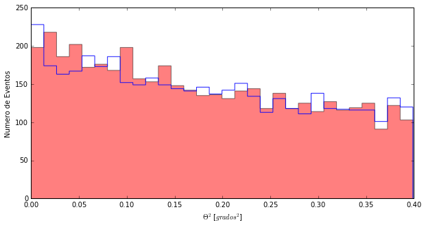
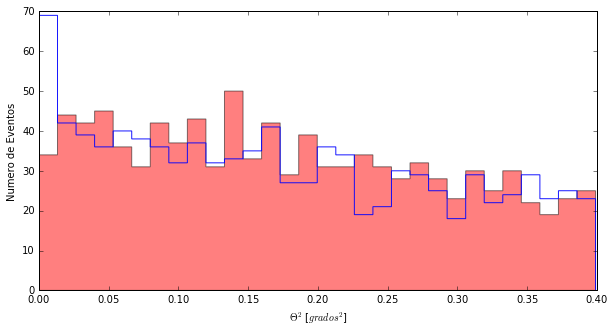
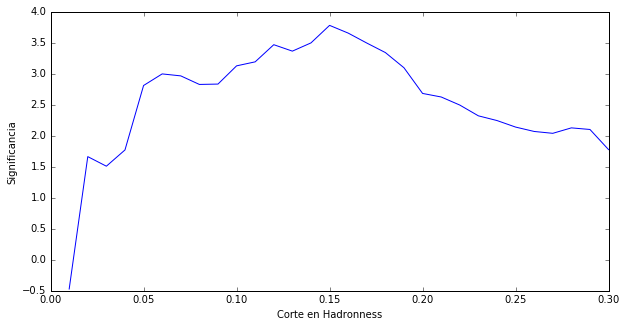
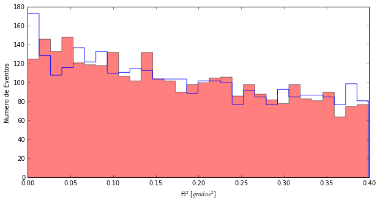

# Let's look at all the data

Once again ... you know how we start, right?


```python
import pandas as pd
import matplotlib.pyplot as pl
from Significancia import *
%matplotlib inline
```

And now, something we already know how to do. Let's read the files with all the data and the values that are in their columns. And this time, let's read not only the value of **Theta Square**, but also that of **hadronness** which are the values that are in the column called **had**


```python
#We read the files and give them a name
cygX1_ON= pd.read_csv('data/EvtList_ON_CygX3_All.txt', sep=' ')
cygX1_OFF= pd.read_csv('data/EvtList_OFF_CygX3_All.txt', sep=' ')

#We see how many rows we are loading in the data
len(cygX1_ON)
```


    84597


```python
#We check how the ON data is, for example
cygX1_ON.head()
```


<div>
<table border="1" class="dataframe">
  <thead>
    <tr style="text-align: right;">
      <th></th>
      <th>had</th>
      <th>theta2</th>
    </tr>
  </thead>
  <tbody>
    <tr>
      <th>0</th>
      <td>1.000</td>
      <td>0.149</td>
    </tr>
    <tr>
      <th>1</th>
      <td>0.126</td>
      <td>0.178</td>
    </tr>
    <tr>
      <th>2</th>
      <td>1.000</td>
      <td>0.011</td>
    </tr>
    <tr>
      <th>3</th>
      <td>0.970</td>
      <td>0.020</td>
    </tr>
    <tr>
      <th>4</th>
      <td>0.995</td>
      <td>0.317</td>
    </tr>
  </tbody>
</table>
</div>

You see the column called **had**? It has the information of the hadroness of each event detected by the telescope. Some have **large hadroness** (1,000, 0.970), they are probably protons or light nuclei. Others have **small hadroness**, that's probably the gammas we're looking for.

With more than eighty thousand rows, the best we can do is represent the data with a **Theta Plot**. But we do not want all the rows, we will only keep the one with **hadroness less than 0.20**

1. We define the variable **had_cut = 0.20**
2. We only select the rows that have **hadroness <had_cut** and save them with the name **CygX1_ON_cut**:
> **cygX1_ON_cut = cygX1_ON [cygX1_ON ['had'] <had_cut]**
> CygX1_ON_cut has fewer rows than CygX1_ON, but the same number of columns. Would you know how to comporbar it?
3. I do the **Theta Plot** as without the cut in hadronnes but now we use **CygX1_ON_cut.theta2**
4. And the same for the OFF, so the comparison makes sense.

```python
# 1  We defined the variable had_cut
had_cut = 0.20
# 2 We selected the data: hadroness less than 0.20
cygX1_ON_cut = cygX1_ON[cygX1_ON['had'] < had_cut]
cygX1_OFF_cut = cygX1_OFF[cygX1_OFF['had'] < had_cut]
# 3 We make the Theta Plot
pl.figure(1, figsize=(10, 5), facecolor='w', edgecolor='k')
Noff, ThetasOff, _ = pl.hist(cygX1_OFF_cut.theta2, bins=30, histtype='stepfilled', color='red', alpha=0.5, normed=False)
Non, ThetasOn, _ = pl.hist(cygX1_ON_cut.theta2, bins=30, histtype='step', color = 'blue',alpha=0.9, normed=False)
pl.xlabel('$\Theta^2$ [$grados^2$]')
pl.ylabel('Numero de Eventos')
pl.show()
CalcularSignificancia(Non, Noff)
```





    -0.48949852089254597


Right, I've done something different. In front of the instruction:

> "pl.hist(CutHad.compressed(), bins=30, histtype='step', color = 'blue',alpha=0.9, normed=False)"

I wrote:

> Non, ThetasOn, _ =

This allows me to save the number of events in each bar of the chart in Non and the value of **Theta Square** that represents that bar in ThetasOn.

And then I use Non and Noff to calculate the significance and ...

My illusion's shattered, you can see it in the graph. With all the data there is nothing and the significance is -0.49 sigmas.

---------

And what happens if we change the cut in hadronness? In fact if instead of 0.20 we cut at 0.06 we recover the sigmas that we had.


```python
# 1 We define the variable had_cut
had_cut = 0.06
# 2 We select the data: hadroness less than 0.06
cygX1_ON_cut = cygX1_ON[cygX1_ON['had'] < had_cut]
cygX1_OFF_cut = cygX1_OFF[cygX1_OFF['had'] < had_cut]
# 3 We make Theta Plot
pl.figure(1, figsize=(10, 5), facecolor='w', edgecolor='k')
Noff, ThetasOff, _ = pl.hist(cygX1_OFF_cut.theta2, bins=30, histtype='stepfilled', color='red', alpha=0.5, normed=False)
Non, ThetasOn, _ = pl.hist(cygX1_ON_cut.theta2, bins=30, histtype='step', color = 'blue',alpha=0.9, normed=False)
pl.xlabel('$\Theta^2$ [$grados^2$]')
pl.ylabel('Numero de Eventos')
pl.show()
CalcularSignificancia(Non, Noff)
```





    2.4003967925959162


**"Trial factors", "Trial factors", "Trial factors", "Trial factors", "Trial factors"**

Yes, yes ... here is my voice of conscience. Looking in your data for the best cut is cheating yourself.

If we do that with the observations we simulated before, we will also get higher **Significance** values and those simulated observations are still by construction statistical fluctuations.

-------

What I can do is to find the best cut for example in the data of the first day and then use that cut (although strictly speaking then you should not use the data of the first day in the final analysis, but ...)

What will come out as best cut for the data of the first day?


```python
from EntrenarCorteHadronness import *
MejorCorte()
```




The graph shows how the Significance changes for different values of the cut.

Well it was not 0.20 the best but 0.15. Let's see what comes with all the data if we cut in hadronness 0.15?

```python
# 1 We defined the variable had_cut
had_cut = 0.15
# 2 We selected the data: hadroness less than 0.15
cygX1_ON_cut = cygX1_ON[cygX1_ON['had'] < had_cut]
cygX1_OFF_cut = cygX1_OFF[cygX1_OFF['had'] < had_cut]
# 3 We make Theta Plot
pl.figure(1, figsize=(10, 5), facecolor='w', edgecolor='k')
Noff, ThetasOff, _ = pl.hist(cygX1_OFF_cut.theta2, bins=30, histtype='stepfilled', color='red', alpha=0.5, normed=False)
Non, ThetasOn, _ = pl.hist(cygX1_ON_cut.theta2, bins=30, histtype='step', color = 'blue',alpha=0.9, normed=False)
pl.xlabel('$\Theta^2$ [$grados^2$]')
pl.ylabel('Numero de Eventos')
pl.show()
CalcularSignificancia(Non, Noff)
```





    1.2950435787475061


Nothing, there is nothing. The first day was either a statistical fluctuation or something that only lasted that day. We will never know and it will remain in history as a fluctuation.
