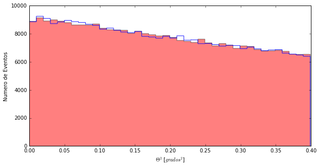
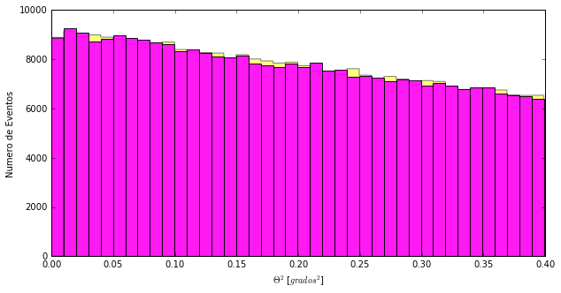

# Quim's scientific notebook

Uff ... now that I know that someone else is going to read this book, I will have to try to write it so that it is understandable. The good part is that when myself read it again in a couple of weeks I may understand something.

Let's see if the dark matter in Perseus generates gamma rays.


```python
import numpy as np
import pandas as pd
import matplotlib.pyplot as pl
%matplotlib inline
```

We already have the libraries that we needs. Time to read the data. Do you remember how to do it? If not, ask Alba when she wants she explains herself very well!


```python
#We read the files and give them a name
perseus_ON= pd.read_csv('data/EvtList_ON_Perseus_Other.txt', sep=' ')
perseus_OFF= pd.read_csv('data/EvtList_OFF_Perseus_Other.txt', sep=' ')
#A see how much data I am loading?
len(perseus_ON)
```


    4111265


4 and a half million rows! That no Excel can open it. Luckily Python yes. And why do we increasingly load more data? Because every time we complicate it a bit.

Alba explained how to make the cut in hadronness. But she already had the data a little prepared. He had stayed with only those who have a **Theta Square** less than 0.4. It is not my case, so to have a **Thetaplot** like Alba or Daniel I need to also make a cut in **Theta Cuadrado** in addition to the one of hadronness.


```python
# 1 We defined the cut variables had_cut and theta_cut
had_cut = 0.20
theta2_cut = 0.40

# 2 We select the data:
perseus_ON_cut = perseus_ON[(perseus_ON['had'] < had_cut) & (perseus_ON['theta2'] < theta2_cut)]
perseus_OFF_cut = perseus_OFF[(perseus_OFF['had'] < had_cut) & (perseus_OFF['theta2'] < theta2_cut)]

# Let me check how much data I have left
len(perseus_ON_cut)
```


    310622


See? After the cuts we are left with some three hundred thousand events.
And I can only do the **Thetaplot**

```python
pl.figure(1, figsize=(10, 5), facecolor='w', edgecolor='k')
Noff, ThetasOff, _ = pl.hist(perseus_OFF_cut.theta2, bins=40, histtype='stepfilled', color='red', alpha=0.5, normed=False)
Non, ThetasOn, _ = pl.hist(perseus_ON_cut.theta2, bins=40, histtype='step', color = 'blue',alpha=0.9, normed=False)
pl.xlabel('$\Theta^2$ [$grados^2$]')
pl.ylabel('Numero de Eventos')
pl.show()
```





It looks like Alba' and Daniel' **ThetaPlot*, right? But in reality it is not the same. Have you seen the difference? Mine is split into more pieces. I have 40 and they only have 30. I have done it with the "bin = 40" in the instruction:


> pl.hist(CutHadOff.compressed(), bins=40, histtype='stepfilled', color='red', alpha=0.5, normed=False)

I can also change other things: the color (color = 'yellow') or how the bars of the graph are painted (histtype = 'bar')

```python
pl.figure(1, figsize=(10, 5), facecolor='w', edgecolor='k')
Noff, ThetasOff, _ = pl.hist(perseus_OFF_cut.theta2, bins=40, histtype='stepfilled', color='yellow', alpha=0.5, normed=False)
Non, ThetasOn, _ = pl.hist(perseus_ON_cut.theta2, bins=40, histtype='bar', color = 'magenta',alpha=0.9, normed=False)
pl.xlabel('$\Theta^2$ [$grados^2$]')
pl.ylabel('Numero de Eventos')
pl.show()
```





Which one do you like the most?

---------

Now we just need to see how significant is what we see. At first glance it seems that it is not, but let's calculate the **significance**.

Alba complains about Daniel, but she also makes some trapdoor ... to calculate the **significance** uses a function without explaining what instructions it contains. Let's solve it!

In fact, the calculation of the significance is very simple:


> S = (N_on - No_off)/sqrt(N_on+N_off)

where sqrt (...) indicates the square root of what is inside the parentheses and that in Python can be written as:
> (N_on+N_off)**(0.5)

To have N_on and N_off I simply add up the events that I have in the first two divisions of the previous graph and that I have saved in the variables **Non** and **Noff** before. 


```python
EventosON=np.sum(Non[0:2])
EventosOFF=np.sum(Noff[0:2])
Significancia=(EventosON-EventosOFF)/(EventosON+EventosOFF)**(0.5)
print ("Eventos ON =", EventosON)
print ("Eventos OFF =", EventosOFF)
print ("Significancia =", Significancia)
```

    ('Eventos ON =', 18111.0)
    ('Eventos OFF =', 18025.0)
    ('Significancia =', 0.45240605872906037)

What I said **0.45 sigmas** or what is the same, we do not see gamma rays that reach us from cie dark matter that is in Perseus. But does this mean that there is no Drak Matter there? We will see that soon and for that I have also noted the number of events ON and OFF.

