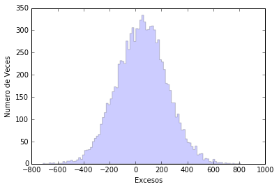
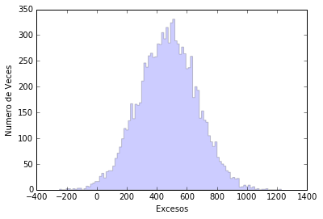

#  L'esperança no està perduda ... el costat fosc encara pot ser-hi

Vegem què vol dir que no vegi senyal de raigs gamma quan observo el clúster de Perseus. Això no vol dir que no ens arribin, només que, si ens arriben, ho fa una quantitat menor que un cert nombre. ¡Vegem-ho!


```python
%matplotlib inline
%pylab inline
import math
import numpy as np
import matplotlib.pyplot as pl
import random as rnd
```

    Populating the interactive namespace from numpy and matplotlib


El primer és implementar el model teòric que ens indica quants raigs gamma ens arriben des del clúster de Perseus. Això depèn de quina part de Perseus estiguem mirant i es pot simplificar amb un paràmetre indicant el radi de la circumferència que estem observant (r). També depèn d'un factor de normalització que anomenarem N0.

Per saber quants raigs gamma ens arriben per a cada valor dels paràmetres, el millor és definir-nos una funció. Ja heu fet servir moltes funcions de python. Vegem ara com es defineix una ... és fàcil:


```python
def NumeroRayosGamma( No, r ):
    if r <= 0.1 :
        Num = No* math.pi*r**(2.0)
    if r > 0.1 :
        Num = No* math.pi*(0.1**(2.0)+1e-4*(0.1**(-2.0)-r**(-2.0)))
    return Num
```

Que sí! Que sí que és fàcil!
Primer es defineix la funció en si: com es diu i quins paràmetres li passem.

> def NumeroRayosGamma( No, r ):

I després definim què fa la funció. Com us comentava, el nombre de raigs gamma que ens arriben del clúster de Perseus depèn de quina part dins el clúster mirem. De fet, el valor és constant si mirem a menys de 0.1 graus del centre, però es redueix ràpidament (amb el radi a la quarta potència) si mirem més lluny. Per tenir en compte les dues opcions hem utilitzat la condició **if**:

> if r <= 0.1 :

> if r > 0.1 :

I dins de cada condició calculem quants raigs gamma veiem mirant des del centre del clúster fins al valor de radi (r) i la normalització (No) que passem a la funció.

Finalment, li diem a la funció que ens retorni el nombre de raigs gamma calculats:

> return Num

Atenció! On comença cada línia de codi és rellevant ... per a mi és el més molest de Python.

--------------

Ara només hem de posar una línia de codi per saber quants raigs gamma ens haurien d'arribar. Per exemple si mirem dins de 0.2 graus i assumim un factor de normalització 1000:

> NumeroRayosGamma( 1000, 0.2 )


```python
NumeroRayosGamma( 1000, 0.2 )
```


    54.97787143782138


De fet, abans hem vist que si compto esdeveniments a les dues primeres divisions del  meu **Thetaplot**, tinc:

> Esdeveniments ON = 18477.0
> Esdeveniments OFF = 18338.0

Com que tinc 40 divisions en **Theta Quadrat** entre 0 i 0.40, això vol dir que les dues primeres divisions cobreixen 0.02 graus quadrats en theta quadrat, que es tradueix en arrel quadrada de 0.02 (0,1414) graus. Per tant per a una normalització de 1000 esperem que ens arribin:

```python
print (NumeroRayosGamma( 1000, 0.1414 ), "rayos gamma")
```

    47.1191445659 rayos gamma


Ara hem de fer alguna cosa semblant al que va fer l'Alba per entendre què vol dir la **Significança**. Ho recordeu?

Tenim que com a valor mig hi ha 18338 esdeveniments de soroll i que de mitjana ens arriben 47.1 esdeveniments. Però això són els valors mitjans. Si observem una sola vegada per les més de 100 hores que ho hem fet els valors poden ser diferents. Com passava amb les observacions que simulava l'Alba assumint que no hi havia senyal. Només que ara assumirem que el senyal és de mitja 47.1 raigs gamma.

Ara que sabeu com es defineix una funció, ja no cal fer-les servir :D. Així que vegem com ho fem per simular aquestes observacions.

-------

Primer definim on volem posar els resultats de la simulació i inicialitzem la funció **rnd** que ens genera nombres aleatoris:

```python
sigma = np.zeros(10000)
exceso = np.zeros(10000)
rnd.seed(1975)
```

Així he creat una variable **sigmas** i una altra **exceso** que per ara són un conjunt de 10000 zeros.

Amb "rnd.seed (1975)" li dono la llavor al generador de nombres aleatoris perquè comenci a generar-los. Això és necessari per que per ara els ordinadors no saben fer coses 100% aleatòries (bé, tampoc tinc clar que jo sabés fer-ho), són pseudo-aleatòries i la sèrie queda definida per la llavor. Però és més que suficient per al que necessitem.

----------

Ara simulem 10000 observacions amb una mitjana de 18338.0 esdeveniments OFF i 18338.0 + 47.1 esdeveniments ON i veiem quants excessos hi ha per a cada observació simulada.


```python
test = NumeroRayosGamma(1000,0.02**(0.5))
for x in range(0, 10000):
      EventosON=rnd.gauss(18338, (18338)**(0.5))+rnd.gauss(test, (test)**(0.5));
      EventosOFF=rnd.gauss(18338, 18338**(0.5));
      sigma[x] = (EventosON-EventosOFF)/(EventosON+EventosOFF)**(0.5)
      exceso[x] = EventosON - EventosOFF
```

Per no haver d'escriure moltes vegades 47.1, m'he creat una variable on poso el valor dels raigs gamma que espero utilitzant la funció que hem definit abans. A més això em permet mirar què passa amb un valor diferent de raigs gamma esperats només canviant una línia de codi:

> test = NumeroRayosGamma(1000,0.02**(0.5))

----------

L'Alba feia servir la variable **sigma**, nosaltres farem servir la variable **exceso**. Vegem quina distribució té.


```python
veces, excesos, _ = pl.hist(exceso, bins=100, histtype='stepfilled',alpha=0.2, normed=False)
pl.xlabel('Excesos')
pl.ylabel('Numero de Veces')
pl.show()
```





Ara vegem quin percentatge d'aquestes observacions simulades ens donarien més excessos dels que veiem en les dades (18.477-18.338 = 139). Per això fem servir les vegades que un excés es produeix i que he guardat a **veces** i **excesos** utilitzant el gràfic que acabo de generar. Te'n recordes com es fa això? Amb "veces, excesos, _ = pl.hist (exceso, bins=100, histtype='stepfilled', alpha=0.2, normed=False)" guardo els valors de l'eix Y del gràfic a ** veces ** i els del eix X a **excesos**.

Ara puc fer un bucle donant valors a x entre 0 i 100 ( "for x in range (0,100):") i comprovar quants cops tenim més excessos que els que hem observat en la nostra observació real. És bàsicament el mateix que va fer l'Alba per veure la probabilitat de tenir 2.7 sigmes.


```python
VecesAcumuladas = np.cumsum(veces)
Probabilidad = 1.0-VecesAcumuladas/(VecesAcumuladas.max())
for x in range(0,100):
        if excesos[x] > (18477.0-18338):
                print ("La Probabilidad de tener más de ", 18477.0-18338, "eventos es: ", Probabilidad[x]*100, "%")
                break
```

La Probabilitat de tenir més de 139.0 esdeveniments és: 28.83%

Quan no tenim senyal a les nostres observacions, el que fem és posar un límit superior als raigs gamma que ens estan arribant. Una forma de fer-ho és buscar el valor de raigs gamma pel qual el 95% de les vegades tindríem més excessos dels que hem observat. Amb la hipòtesi N0 = 1000, ens vam quedar lluny.

------

Ara és quan em va molt bé utilitzar la variable **test** i tenir definida la funció **NumeroRayosGamma (No, r)**. Facilita el buscar per quin valor de N0 es compleix la condició.


```python
test = NumeroRayosGamma(10000,0.02**(0.5))
for x in range(0, 10000):
      EventosON=rnd.gauss(18338, (18338)**(0.5))+rnd.gauss(test, (test)**(0.5));
      EventosOFF=rnd.gauss(18338, 18338**(0.5));
      sigma[x] = (EventosON-EventosOFF)/(EventosON+EventosOFF)**(0.5)
      exceso[x] = EventosON - EventosOFF
veces, excesos, _ = pl.hist(exceso, bins=100, histtype='stepfilled',alpha=0.2, normed=False)
pl.xlabel('Excesos')
pl.ylabel('Numero de Veces')
VecesAcumuladas = np.cumsum(veces)
Probabilidad = 1.0-VecesAcumuladas/(VecesAcumuladas.max())
for x in range(0,100):
        if excesos[x] > (18477.0-18338):
                print ("La Probabilidad de tener más de ", 18477.0-18338, "eventos es: ", Probabilidad[x]*100, "%, cuando esperamos ", test, "rayos gamma, que se obtienen con N0 = ",10000)
                break
```

La Probabilitat de tenir més de 139.0 esdeveniments és: 94.64%, quan esperem 471.238898038 raigs gamma, que s'obtenen amb N0 = 10000




**N0** està relacionat amb la quantitat de matèria fosca que hi ha al clúster de Perseus. Així que les meves dades no em diuen que no hi hagi matèria fosca allà, només que n'hi ha menys que una certa quantitat ... l'esperança no està perduda.
