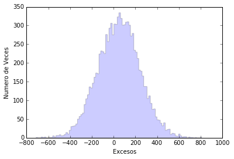

# # Hope is not lost ... the dark side may still be there

Let's see what it means to not see a gamma-ray signal when I look at the Perseus cluster. That does not mean that they do not arrive to us, only that, if they arrive to us, they do it an amount smaller than a certain number. Let's see it!


```python
%matplotlib inline
%pylab inline
import math
import numpy as np
import matplotlib.pyplot as pl
import random as rnd
```

    Populating the interactive namespace from numpy and matplotlib


The first is to implement the theoretical model that tells us how many gamma rays come from the Perseus cluster. That depends on what part of Perseus we are looking at and can be simplified with a parameter indicating the radius of the circumference we are observing (r). It also depends on a normalization factor that we will call N0.

To know how many gamma rays reach us for each value of the parameters, it is best to define a function. You have already used many python functions. Let's see now how to define a ... it's easy:


```python
def NumeroRayosGamma( No, r ):
    if r <= 0.1 :
        Num = No* math.pi*r**(2.0)
    if r > 0.1 :
        Num = No* math.pi*(0.1**(2.0)+1e-4*(0.1**(-2.0)-r**(-2.0)))
    return Num
```

Yes! That's easy!
First define the function itself: as it is called and what parameters we pass.

> def NumeroRayosGamma( No, r ):

I then define what the function does. As I was saying, the number of gamma rays that come from the Perseus cluster depends on which part of the cluster we look at. In fact, the value is constant if we look at less than 0.1 degrees from the center, but it decreases rapidly (with the radius to the fourth power) if we look
further away. To take into account the two options we used the **if** condition:

> if r <= 0.1 :

> if r > 0.1 :

And within each condition we calculate how many gamma rays we see looking from the center of the cluster to the value of radius (r) and the normalization (No) that we pass to the function.

Finally, we tell the function to return the number of calculated gamma rays:

> return Num

Be careful! Where each line of code starts is relevant ... for me it is the most annoying thing about Python.

--------------

Now we just have to put a line of code to know how many gamma rays should reach us. For example, if we look inside 0.2 degrees and assume a normalization factor of 1000:

> NumeroRayosGamma( 1000, 0.2 )


```python
NumeroRayosGamma( 1000, 0.2 )
```


    54.97787143782138


In fact, before we saw that if I count events in the first two divisions of my **Thetaplot**, I have:

> Events ON = 18477.0
> Events OFF = 18338.0

Since I have 40 divisions in **Theta Square** between 0 and 0.40, that means that the first two divisions cover 0.02 square degrees in the square theta, which translates to a square root of 0.02 (0.1414) degrees. Therefore for a normalization of 1000 we hope that they reach us

```python
print (NumeroRayosGamma( 1000, 0.1414 ), "rayos gamma")
```

    47.1191445659 rayos gamma


Now we have to do something similar to what Alba did to understand what the **Significance** means. Do you remember?

We have that as an average there are 18,338 noise events and that on average 47.1 events arrive. But that's the average values. If we observe only once for the more than 100 hours that we have done, the values may be different. As it happened with the observations simulated by Alba assuming there was no signal. Only now we will assume that the signal is in average 47.1 gamma rays.

Now that you know how to define a function, you no longer need to use them :D. So let's see how we do to simulate those observations.

-------

First we define where we want to put the results of the simulation and initialize the function **rnd** that generates random numbers:

```python
sigma = np.zeros(10000)
exceso = np.zeros(10000)
rnd.seed(1975)
```

So I have created a variable **sigma** and another **exceso** that for now are a set of 10000 zeros.

With "rnd.seed (1975)" I give the seed to the random number generator so that it starts generating them. That is necessary because for now computers do not know how to do 100% random things (well, I'm not sure I knew how to do it either), they are pseudo-random and the series is defined by the seed. But it is more than enough for what we need.

----------

Now we simulate 10000 observations for which we have an average of 18338.0 events OFF and 18338.0 + 47.1 events ON and we see how many excesses there are for each simulated observation.


```python
test = NumeroRayosGamma(1000,0.02**(0.5))
for x in range(0, 10000):
      EventosON=rnd.gauss(18338, (18338)**(0.5))+rnd.gauss(test, (test)**(0.5));
      EventosOFF=rnd.gauss(18338, 18338**(0.5));
      sigma[x] = (EventosON-EventosOFF)/(EventosON+EventosOFF)**(0.5)
      exceso[x] = EventosON - EventosOFF
```

To avoid having to write 47.1 many times, I have created a variable where I put the value of the gamma rays that I expect using the function that we defined earlier. Also that allows me to see what happens with a different value of expected gamma rays just by changing a line of code:

> test = NumeroRayosGamma(1000,0.02**(0.5))

----------

Alba used the variable **sigma**, we will use the variable **exceso**. Let's see what distribution it has.


```python
veces, excesos, _ = pl.hist(exceso, bins=100, histtype='stepfilled',alpha=0.2, normed=False)
pl.xlabel('Excesos')
pl.ylabel('Numero de Veces')
pl.show()
```





Now let's see what percentage of these simulated observations would give us more excesses than we see in the data (18477-18338 = 139). For that we use the times that an excess occurs and that I have saved in **veces** and **excesos** using the graph that I just generated. Do you remember how this is done? With "veces, excesos, _ = pl.hist (exceso, bins=100, histtype='stepfilled', alpha=0.2, normed=False)" I keep the Y axis values of the graph in **veces** and those of the X axis in **excesos**

Now I can make a loop giving values ​​to x between 0 and 100 ("for x in range (0.100):") and check when we have more than what we observed in our actual observation. It's basically the same thing that Alba did to see the probability of having 2.7 sigmas.


```python
VecesAcumuladas = np.cumsum(veces)
Probabilidad = 1.0-VecesAcumuladas/(VecesAcumuladas.max())
for x in range(0,100):
        if excesos[x] > (18477.0-18338):
                print ("La Probabilidad de tener más de ", 18477.0-18338, "eventos es: ", Probabilidad[x]*100, "%")
                break
```

The Probability of having more than 139.0 events is: 28.83%

When we have no signal in our observations, what we do is to put an upper limit to the gamma rays that are reaching us. One way to do this is to look for the gamma-ray value for which 95% of the time we would have more excesses than we have observed. With the hypothesis of N0 = 1000, we are far away.

------

Now is when it is good for me to use the variable **test** and to have defined the function **NumberRaysGamma (No, r)**. It makes it easier to search for what value of N0 the condition is met.

```python
test = NumeroRayosGamma(10000,0.02**(0.5))
for x in range(0, 10000):
      EventosON=rnd.gauss(18338, (18338)**(0.5))+rnd.gauss(test, (test)**(0.5));
      EventosOFF=rnd.gauss(18338, 18338**(0.5));
      sigma[x] = (EventosON-EventosOFF)/(EventosON+EventosOFF)**(0.5)
      exceso[x] = EventosON - EventosOFF
veces, excesos, _ = pl.hist(exceso, bins=100, histtype='stepfilled',alpha=0.2, normed=False)
pl.xlabel('Excesos')
pl.ylabel('Numero de Veces')
VecesAcumuladas = np.cumsum(veces)
Probabilidad = 1.0-VecesAcumuladas/(VecesAcumuladas.max())
for x in range(0,100):
        if excesos[x] > (18477.0-18338):
                print ("La Probabilidad de tener más de ", 18477.0-18338, "eventos es: ", Probabilidad[x]*100, "%, cuando esperamos ", test, "rayos gamma, que se obtienen con N0 = ",10000)
                break
```

The probability of having more than 139.0 events is: 94.64%, when we expect 471.238898038 gamma rays, which are obtained with N0 = 10000


**N0** is related to the amount of dark matter in the Perseus cluster. So my data does not tell me that there is no dark matter there, only that there is less than a certain amount ... hope is not lost.
