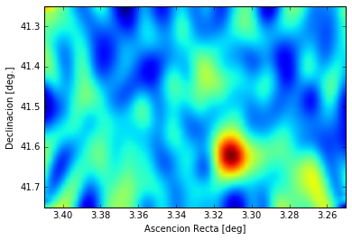
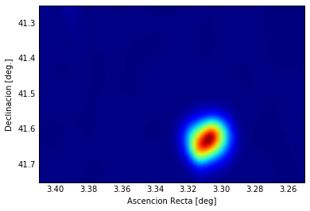
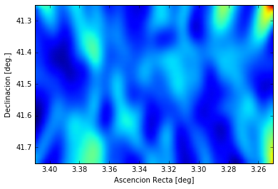

```python
import numpy as np
import pandas as pd
import matplotlib.pyplot as pl
import scipy.ndimage as ndimage
%matplotlib inline
```

      warnings.warn('Matplotlib is building the font cache using fc-list. This may take a moment.')


# El mapa del cel de vegades porta sorpreses

Ja que tenim les dades i encara que no vegem res al centre del Clúster de Perseus, mirem com es veu el cel extrem (el dels raigs gamma) al voltant de Perseus ... ho podem fer amb les mateixes dades que fem servir per fer el **theta plot**, igual que va fer el Daniel per Cas A.


```python
# Llegim els fitxers i els donem un nom
perseus_ON= pd.read_csv('data/EvtList_ON_Perseus_All.txt', sep=' ')
perseus_OFF= pd.read_csv('data/EvtList_OFF_Perseus_All.txt', sep=' ')

# Definim les variables de tall
had_cut = 0.20

# Seleccionem les dades:
perseus_ON_cut = perseus_ON[perseus_ON['had'] < had_cut]
perseus_OFF_cut = perseus_OFF[perseus_OFF['had'] < had_cut]

# Mirem quina pinta tenen les dades que hem carregat i seleccionat
perseus_ON_cut.head(5)
```


<div>
<table border="1" class="dataframe">
  <thead>
    <tr style="text-align: right;">
      <th></th>
      <th>had</th>
      <th>theta2</th>
      <th>XCam</th>
      <th>YCam</th>
    </tr>
  </thead>
  <tbody>
    <tr>
      <th>0</th>
      <td>0.077</td>
      <td>0.139</td>
      <td>-0.323</td>
      <td>0.185</td>
    </tr>
    <tr>
      <th>27</th>
      <td>0.083</td>
      <td>0.253</td>
      <td>0.064</td>
      <td>0.498</td>
    </tr>
    <tr>
      <th>31</th>
      <td>0.119</td>
      <td>0.279</td>
      <td>0.452</td>
      <td>-0.271</td>
    </tr>
    <tr>
      <th>34</th>
      <td>0.117</td>
      <td>0.545</td>
      <td>-0.688</td>
      <td>-0.266</td>
    </tr>
    <tr>
      <th>42</th>
      <td>0.119</td>
      <td>0.478</td>
      <td>0.677</td>
      <td>-0.136</td>
    </tr>
  </tbody>
</table>
</div>


Fixa't que ara tenim dues columnes noves: **XCam** i **YCam**. Aquestes ens indiquen per a cada esdeveniment l'adreça d'on creiem que ve. Cada posició a la càmera indica una posició al cel.

------

Vegem en detall com ho feia el Daniel en la seva funció **skymap**.

En comparació amb el **thetaplot** aquí volem representar les dades en 2 dimensions: posicions X i Y. Per això hem de fer servir la funció **np.histogram2d** en lloc de **pl.hist**. Funciona de manera molt semblant. Només que necessitem donar-li dues variables, per exemple **camX_perseus** i **camY_perseus**.

A més, la direcció d'arribada de cada esdeveniment té un error. Això implica que cada esdeveniment té probabilitat de venir no només d'un punt concret sinó d'una regió del cel. Per tenir això en compte posem contribució de cada esdeveniment a l'adreça reconstruïda i els seus voltants. Això ho fem per les dades OFF i ON:

> img1 = ndimage.gaussian_filter(hist_off, sigma=(5, 2), order=0)

> img2 = ndimage.gaussian_filter(hist_perseus, sigma=(5, 2), order=0)

Ara podem calcular els excessos fent ON menys OFF:

> hist_excess = np.subtract(img2, img1)

A més, sabem que l'eficiència per detectar esdeveniments no és la mateixa en tota la cambra. Una forma simple per avaluar aquesta eficiència és utilitzar les dades OFF i simplement dividir els excessos per l'OFF que hi ha a cada punt de la càmera. Per això fem:

> hist_excess = np.divide(hist_excess, img1)

I només ens faltaria mostrar el gràfic 2D que queda després d'haver fet aquestes operacions.


```python
# Skymap de les dades seleccionades:
hist_perseus, xedge, yedge = np.histogram2d(perseus_ON_cut.XCam, perseus_ON_cut.YCam, bins=71)
hist_off, xedge, yedge = np.histogram2d(perseus_OFF_cut.XCam, perseus_OFF_cut.YCam, bins=71)
img1 = ndimage.gaussian_filter(hist_off, sigma=(5, 2), order=0)
img2 = ndimage.gaussian_filter(hist_perseus, sigma=(5, 2), order=0)
hist_excess = np.subtract(img2, img1)
hist_excess = np.divide(hist_excess, img1)
pl.imshow(hist_excess, interpolation='gaussian', extent=[3.41,3.25,41.75,41.25],aspect="auto")
pl.xlabel('Ascencion Recta [deg]')
pl.ylabel('Declinacion [deg.]')
pl.show()
```





Eh! Aquí hi ha alguna cosa ... I de fet no recordo haver-ho vist abans. Mirem si està sempre o només en les dades que prenem ahir.

```python
# Llegim els fitxers i els hi donem un nom:
perseus_ON= pd.read_csv('data/EvtList_ON_Perseus_LastDay.txt', sep=' ')
perseus_OFF= pd.read_csv('data/EvtList_OFF_Perseus_LastDay.txt', sep=' ')

# Definim les variables de tall:
had_cut = 0.20

# Seleccionem les dades:
perseus_ON_cut = perseus_ON[perseus_ON['had'] < had_cut]
perseus_OFF_cut = perseus_OFF[perseus_OFF['had'] < had_cut]

# Representem el Skymap:
hist_perseus, xedge, yedge = np.histogram2d(perseus_ON_cut.XCam, perseus_ON_cut.YCam, bins=71)
hist_off, xedge, yedge = np.histogram2d(perseus_OFF_cut.XCam, perseus_OFF_cut.YCam, bins=71)
img1 = ndimage.gaussian_filter(hist_off, sigma=(5, 2), order=0)
img2 = ndimage.gaussian_filter(hist_perseus, sigma=(5, 2), order=0)
hist_excess = np.subtract(img2, img1)
hist_excess = np.divide(hist_excess, img1)
pl.imshow(hist_excess, interpolation='gaussian', extent=[3.41,3.25,41.75,41.25],aspect="auto")
pl.xlabel('Ascencion Recta [deg]')
pl.ylabel('Declinacion [deg.]')
pl.show()
```





Ahir es veia molt bé ... a veure a la resta de les dades ...


```python
# Llegim els fitxers i els hi donem un nom:
perseus_ON= pd.read_csv('data/EvtList_ON_Perseus_Other.txt', sep=' ')
perseus_OFF= pd.read_csv('data/EvtList_OFF_Perseus_Other.txt', sep=' ')

# Definim les variables de tall:
had_cut = 0.20

# Seleccionem les dades:
perseus_ON_cut = perseus_ON[perseus_ON['had'] < had_cut]
perseus_OFF_cut = perseus_OFF[perseus_OFF['had'] < had_cut]

# Representem el Skymap:
hist_perseus, xedge, yedge = np.histogram2d(perseus_ON_cut.XCam, perseus_ON_cut.YCam, bins=71)
hist_off, xedge, yedge = np.histogram2d(perseus_OFF_cut.XCam, perseus_OFF_cut.YCam, bins=71)
img1 = ndimage.gaussian_filter(hist_off, sigma=(5, 2), order=0)
img2 = ndimage.gaussian_filter(hist_perseus, sigma=(5, 2), order=0)
hist_excess = np.subtract(img2, img1)
hist_excess = np.divide(hist_excess, img1)
pl.imshow(hist_excess, interpolation='gaussian', extent=[3.41,3.25,41.75,41.25],aspect="auto")
pl.xlabel('Ascencion Recta [deg]')
pl.ylabel('Declinacion [deg.]')
pl.show()
```





I a la resta de les dades no hi ha res ... això és el que anomenem un flare i sembla ser molt intens. Si vols saber més sobre flares, passa una nit amb la Leyre ... jo ara mateix la aviso i li dic que he vist aquest.
