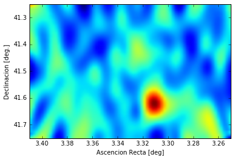

```python
import numpy as np
import pandas as pd
import matplotlib.pyplot as pl
import scipy.ndimage as ndimage
%matplotlib inline
```

      warnings.warn('Matplotlib is building the font cache using fc-list. This may take a moment.')


# The sky map sometimes brings surprises

Since we have the data and although we do not see anything in the center of the Perseus Cluster, let's look at how the extreme sky (the gamma ray) looks around Perseus ... we can do it with the same data we use to make the **theta plot**, just like Daniel did for Cas A.


```python
# We read the files and give them a name
perseus_ON= pd.read_csv('data/EvtList_ON_Perseus_All.txt', sep=' ')
perseus_OFF= pd.read_csv('data/EvtList_OFF_Perseus_All.txt', sep=' ')

# We define the cut variables
had_cut = 0.20

# We select the data:
perseus_ON_cut = perseus_ON[perseus_ON['had'] < had_cut]
perseus_OFF_cut = perseus_OFF[perseus_OFF['had'] < had_cut]

# We check waht our loaded and selected data looks like
perseus_ON_cut.head(5)
```


<div>
<table border="1" class="dataframe">
  <thead>
    <tr style="text-align: right;">
      <th></th>
      <th>had</th>
      <th>theta2</th>
      <th>XCam</th>
      <th>YCam</th>
    </tr>
  </thead>
  <tbody>
    <tr>
      <th>0</th>
      <td>0.077</td>
      <td>0.139</td>
      <td>-0.323</td>
      <td>0.185</td>
    </tr>
    <tr>
      <th>27</th>
      <td>0.083</td>
      <td>0.253</td>
      <td>0.064</td>
      <td>0.498</td>
    </tr>
    <tr>
      <th>31</th>
      <td>0.119</td>
      <td>0.279</td>
      <td>0.452</td>
      <td>-0.271</td>
    </tr>
    <tr>
      <th>34</th>
      <td>0.117</td>
      <td>0.545</td>
      <td>-0.688</td>
      <td>-0.266</td>
    </tr>
    <tr>
      <th>42</th>
      <td>0.119</td>
      <td>0.478</td>
      <td>0.677</td>
      <td>-0.136</td>
    </tr>
  </tbody>
</table>
</div>


Notice that now we have two new columns: **XCam** and **YCam**. These indicate for each event the address where we think it comes from. Each position in the camera indicates a position in the sky.

------

Let's see in detail what Daniel did in his function **skymap**.

In comparison with the **thetaplot** here we want to represent the data in 2 dimensions: positions X and Y. For that we have to use the function **np.histogram2d** instead of **pl.hist**. It works in a very similar way. We just need to give it two variables, for example **camX_perseus** and **camY_perseus**.

Also, the arrival address of each event has an error. This implies that each event is likely to come not only from a specific point but from a region of the sky. To take this into account we put contribution of each event to the reconstructed address and its surroundings. We do this with the instructions for the OFF and ON data:

> img1 = ndimage.gaussian_filter(hist_off, sigma=(5, 2), order=0)

> img2 = ndimage.gaussian_filter(hist_perseus, sigma=(5, 2), order=0)

Now we can calculate the excesses by doing ON minus OFF:

> hist_excess = np.subtract(img2, img1)

In addition, we know that the efficiency to detect events is not the same in the whole chamber. A simple way to evaluate this efficiency is to use the OFF data and simply divide the excesses by the OFF that is in each point of the camera. For that we do:

> hist_excess = np.divide(hist_excess, img1)

And we just need to show the 2D chart that remains after doing these operations.


```python
# Skymap of the selected data:
hist_perseus, xedge, yedge = np.histogram2d(perseus_ON_cut.XCam, perseus_ON_cut.YCam, bins=71)
hist_off, xedge, yedge = np.histogram2d(perseus_OFF_cut.XCam, perseus_OFF_cut.YCam, bins=71)
img1 = ndimage.gaussian_filter(hist_off, sigma=(5, 2), order=0)
img2 = ndimage.gaussian_filter(hist_perseus, sigma=(5, 2), order=0)
hist_excess = np.subtract(img2, img1)
hist_excess = np.divide(hist_excess, img1)
pl.imshow(hist_excess, interpolation='gaussian', extent=[3.41,3.25,41.75,41.25],aspect="auto")
pl.xlabel('Ascencion Recta [deg]')
pl.ylabel('Declinacion [deg.]')
pl.show()
```





Hey! There's something ... And in fact I do not remember seeing it before. Let's see if it is always there or only in the data that we took yesterday.


```python
# We read the files and give them a name:
perseus_ON= pd.read_csv('data/EvtList_ON_Perseus_LastDay.txt', sep=' ')
perseus_OFF= pd.read_csv('data/EvtList_OFF_Perseus_LastDay.txt', sep=' ')

# We define the cut variables:
had_cut = 0.20

# We select the data:
perseus_ON_cut = perseus_ON[perseus_ON['had'] < had_cut]
perseus_OFF_cut = perseus_OFF[perseus_OFF['had'] < had_cut]

# We represent the Skymap:
hist_perseus, xedge, yedge = np.histogram2d(perseus_ON_cut.XCam, perseus_ON_cut.YCam, bins=71)
hist_off, xedge, yedge = np.histogram2d(perseus_OFF_cut.XCam, perseus_OFF_cut.YCam, bins=71)
img1 = ndimage.gaussian_filter(hist_off, sigma=(5, 2), order=0)
img2 = ndimage.gaussian_filter(hist_perseus, sigma=(5, 2), order=0)
hist_excess = np.subtract(img2, img1)
hist_excess = np.divide(hist_excess, img1)
pl.imshow(hist_excess, interpolation='gaussian', extent=[3.41,3.25,41.75,41.25],aspect="auto")
pl.xlabel('Ascencion Recta [deg]')
pl.ylabel('Declinacion [deg.]')
pl.show()
```


Yesterday it was very clear ... let us check waht happend with the rest of the data ...


```python
# We read the files and give them a name:
perseus_ON= pd.read_csv('data/EvtList_ON_Perseus_Other.txt', sep=' ')
perseus_OFF= pd.read_csv('data/EvtList_OFF_Perseus_Other.txt', sep=' ')

# We define the cut variables:
had_cut = 0.20

# We select the data:
perseus_ON_cut = perseus_ON[perseus_ON['had'] < had_cut]
perseus_OFF_cut = perseus_OFF[perseus_OFF['had'] < had_cut]

# We represent the Skymap:
hist_perseus, xedge, yedge = np.histogram2d(perseus_ON_cut.XCam, perseus_ON_cut.YCam, bins=71)
hist_off, xedge, yedge = np.histogram2d(perseus_OFF_cut.XCam, perseus_OFF_cut.YCam, bins=71)
img1 = ndimage.gaussian_filter(hist_off, sigma=(5, 2), order=0)
img2 = ndimage.gaussian_filter(hist_perseus, sigma=(5, 2), order=0)
hist_excess = np.subtract(img2, img1)
hist_excess = np.divide(hist_excess, img1)
pl.imshow(hist_excess, interpolation='gaussian', extent=[3.41,3.25,41.75,41.25],aspect="auto")
pl.xlabel('Ascencion Recta [deg]')
pl.ylabel('Declinacion [deg.]')
pl.show()
```


And in the rest of the data there is nothing ... this is what we call a flare and it seems to be very intense. If you want to know more about flares, spend a night with Leyre ... I'll call her right now and tell her I've seen this one.

