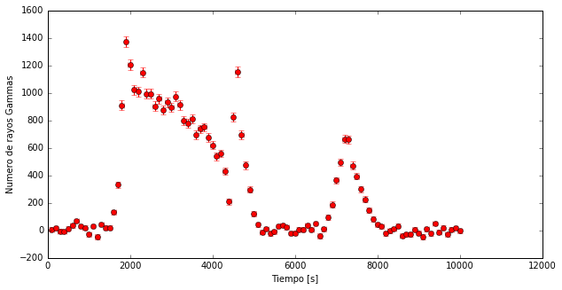

# La llibreta científica de Leyre

Segur que després de passar una nit amb el Daniel, l'Alba i el Quim, ja ets una experta en això de analitzar dades i de programar amb Python. I segurament molt del que hi ha a la meva llibreta ja ho saps fer sense ajuda. Però espero poder ensenyar-te encara alguna cosa nova!

---------

Per començar, vegem si hi ha raigs gamma a les dades que prenem. La gent de VERITAS estava molt emocionada. Però no seria la primera vegada que l'emoció es transforma en decepció.

El **Thetaplot** ja el tens controlat, no?

```python
import pandas as pd
import numpy as np
import matplotlib.pyplot as pl
%matplotlib inline
```


```python
# Llegim els fitxers i els hi donem un nom
mrk421_ON= pd.read_csv('data/EvtList_ON_Mrk421.txt', sep=' ')
mrk421_OFF= pd.read_csv('data/EvtList_OFF.txt', sep=' ')

# Definim les variables de tall had_cut i theta_cut
had_cut = 0.20
theta2_cut = 0.40

# Seleccionem les dades:
mrk421_ON_cut = mrk421_ON[(mrk421_ON['had'] < had_cut) & (mrk421_ON['theta2'] < theta2_cut)]
mrk421_OFF_cut = mrk421_OFF[(mrk421_OFF['had'] < had_cut) & (mrk421_OFF['theta2'] < theta2_cut)]


pl.figure(1, figsize=(10, 5), facecolor='w', edgecolor='k')
Noff, ThetasOff, _ = pl.hist(mrk421_OFF_cut.theta2, bins=40, histtype='stepfilled', color='red', alpha=0.5, normed=False)
Non, ThetasOn, _ = pl.hist(mrk421_ON_cut.theta2, bins=40, histtype='step', color = 'blue',alpha=0.9, normed=False)
pl.xlabel('$\Theta^2$ [$grados^2$]')
pl.ylabel('Numero de Eventos')
pl.show()
```


És cert!!! Com que Mrk 421 estava en flare no vam perdre el temps prenent OFF data, vam agafar tant ON com vam poder. Mai se sap quant temps durarà un flare. Així que vam estar bàsicament 3 hores seguides prenent dades ON de Mrk 421. I clar, ara els esdeveniments **ON** i **OFF** no em coincideixen.

Bé, això té una solució fàcil. El que realment m'interessa és saber quin és el **OFF** a la zona on hi ha senyal: valors de **Theta Quadrat** petits. Així que puc buscar per quin factor he de multiplicar el **OFF** perquè em coincideixi amb el **ON** a valors de **Theta Quadrat** grans (entre 0.25 i 0.35, per exemple). Aquest factor el faig servir per escalar tot el **OFF** i ja tinc una bona estimació de quants esdeveniments de **ON** no són raigs gamma que vinguin de Mrk 421.

```python
eventos_off =  sum(Noff[26:35])
eventos_on = sum(Non[26:35])
factor = eventos_on / eventos_off
print ("Necessitem escalar l'OFF per un factor:", factor)
```

    ('Necessitem escalar l'OFF per un factor:', 4.7118271695349687)


Ja tinc el factor d'escala, entens com ho he fet? Ara vegem com ho aplico a tots els esdeveniments de les observacions **OFF**.

La forma més fàcil de fer-ho és amb pesos ... 'weights' en anglès, que és l'idioma bàsic que utilitza Python.

```python
pl.figure(2, figsize=(10, 5), facecolor='w', edgecolor='k')
# Creem una variable 'weights'. I l'omplim d'uns (ones_like) multiplicat pel
# factor que acabem de trobar
weights = np.ones_like(mrk421_OFF_cut.theta2)*factor
# I ara només cal afegir a la funció que ja coneixem: pl.hist, un paràmetre:
# weights=weights
Noff, ThetasOff, _ = pl.hist(mrk421_OFF_cut.theta2, bins=40, histtype='stepfilled', color='red', alpha=0.5, normed=False, weights=weights)
Non, ThetasOn, _ = pl.hist(mrk421_ON_cut.theta2, bins=40, histtype='step', color = 'blue',alpha=0.9, normed=False)
pl.xlabel('$\Theta^2$ [$grados^2$]')
pl.ylabel('Numero de Eventos')
pl.show()
```


Wow !!! Doncs si, estava en flare. Tinc més raigs gamma en 3 hores (concretament 10000 segons) dels que mai tindran el Daniel, l'Alba i el Quim.

--------

I de fet, amb tants raigs gamma podem mirar si la quantitat que ens arriba canvia amb el temps. Perquè, de fet, en això consisteixen els flares: el nombre de raigs gamma que ens arriben d'un lloc augmenta per un cert temps.

Per això, el primer que necessito és consultar el temps d'arribada de cada esdeveniment **ON**. Faré servir sempre el mateix **OFF**, que no canvia amb el temps.

Les nostres dades incorporen una columna nova anomenada **Temps** que ens indica el moment en que el telescopi detecta els raigs gamma.


```python
mrk421_ON_cut.head()
```


<div>
<table border="1" class="dataframe">
  <thead>
    <tr style="text-align: right;">
      <th></th>
      <th>Energia</th>
      <th>had</th>
      <th>theta2</th>
      <th>Tiempo</th>
    </tr>
  </thead>
  <tbody>
    <tr>
      <th>24</th>
      <td>90.0</td>
      <td>0.130</td>
      <td>0.333</td>
      <td>8346.26</td>
    </tr>
    <tr>
      <th>31</th>
      <td>172.0</td>
      <td>0.006</td>
      <td>0.003</td>
      <td>9033.70</td>
    </tr>
    <tr>
      <th>32</th>
      <td>85.0</td>
      <td>0.062</td>
      <td>0.239</td>
      <td>1300.29</td>
    </tr>
    <tr>
      <th>34</th>
      <td>61.0</td>
      <td>0.159</td>
      <td>0.268</td>
      <td>2116.28</td>
    </tr>
    <tr>
      <th>54</th>
      <td>3081.0</td>
      <td>0.196</td>
      <td>0.204</td>
      <td>7509.42</td>
    </tr>
  </tbody>
</table>
</div>


I per fer servir la columna **Tempo**, tant en l'ON com a l'OFF saps que només cal fer:
> mrk421_ON_cut.Tiempo

----------

Ara vull veure com els raigs gamma ens arriben a mesura que passen els segons. Recordeu que això és un flare, una explosió, així que esperem que el nombre de Gammas canviï amb el temps ràpidament. Però el millor és veure-ho amb els nostres ulls.

Aquesta gràfica que busquem es diu **Lightcurve** (corba de llum) i ens mostra el nombre d'excessos (**ON - OFF**) que tinc en cada interval de temps.

Així és com es poden fer els càlculs i la gràfica.


```python
# Com calcular un Lightcurve

# 1 Preparem les dades tenint en compte que els excessos els calculem amb:
#    a/ Després del tall en hadronness
#    b/ Utilizant els esdeveniments en els dos primers bin del Theta Plot, 
#       és a dir Theta Quadrat <0.02
#    c/ Amb l'OFF i el ON normalitzats
had_cut = 0.20
theta2_cut = 0.02
mrk421_ON_cut_LightCurve = mrk421_ON[(mrk421_ON['had'] < had_cut) & (mrk421_ON['theta2'] < theta2_cut)]
mrk421_OFF_cut_LightCurve = mrk421_OFF[(mrk421_OFF['had'] < had_cut) & (mrk421_OFF['theta2'] < theta2_cut)]
weights = np.ones_like(mrk421_OFF_cut_LightCurve.theta2)*factor

# 2 Calcular Non i Noff per a cada interval de temps.
# Anem a definir 100 intervals (bins) en els 10000 segons de les nostres dades
bins =100
Non, tiempos= np.histogram(mrk421_ON_cut_LightCurve.Tiempo, bins=bins)
Noff, bins_off= np.histogram(mrk421_OFF_cut_LightCurve.Tiempo, bins=tiempos, weights=weights)

# 3 Calcular l'Excés i el seu Error per a cada interval de temps.
Exceso= Non - Noff
Error= (Non + Noff)**0.5

# 4 Representar el lightcurve: els excessos amb els seus errors al llarg del temps
pl.figure(1, figsize=(10, 5), facecolor='w', edgecolor='k')
pl.errorbar(tiempos[1:], Exceso, xerr=10000.0/(2.0*bins), yerr= Error, fmt='or', ecolor='red')
pl.xlabel('Tiempo [s]')
pl.ylabel('Numero de rayos Gammas')
pl.show()
```





Genial! La quantitat de raigs gamma canvia i ho fa molt ràpid. Quan tenim la sort d'observar un flare així, podem treure molta informació. Tant de la font en si i dels processos que hi succeixen, com de què els passa als raigs gamma mentre viatgen des de la font fins a la terra. A mi el que més m'interessa és aquesta segona part!

-------
Nota:
A diferència del **Thetaplot**, en el pas 4 no vull representar quantes vegades passa alguna cosa en les meves dades. Vull mostrar una variable (Nombre de Excessos) en funció d'una altra (Temps), amb els seus errors. Per això no puc fer servir "pl.hist". Utilitzo una altra funció que fa exactament el que necessito:

> Pl.errorbar (VariableEjeX, VariableEjeY)

A més se li poden donar paràmetres addicionals per definir:

> Error a l'Eix X: xerr = ???
> Error a l'Eix Y: yerr = ???
> Format dels punts: fmt = 'or', o per tenir un cercle en cada punt i r perquè sigui vermell
> Color per representar els errors: ecolor = 'xarxa'

Així representem el nombre d'excessos en funció del temps, això és el que anomenem **Light Curve** (corba de llum).
--------

Ara anem a representar les dades d'una forma diferent:

Veiem com canvien amb el temps els raigs Gamma que detecta la càmera del telescopi en els 10000 segons que dura el flare. Si et fixes pots veure clarament quan es produeix el flare a l'ON, mentre a l'OFF tot segueix igual. I, és clar, coincideix amb els pics del lightcurve. Els esdeveniments es concentren al centre de la càmera perquè estem apuntant a Mrk421.

Per què hi ha deteccions que són circumferències? La mida dels esdeveniments representa la seva energia.


```python
from IPython.display import HTML
HTML("""
<video width="600" height="600" controls="" autoplay="" loop="">
  <source src="data/animation_ONOFF.mp4" type="video/mp4">
</video>
""")
```


<video width="600" height="600" controls="" autoplay="" loop="">
  <source src="data/animation_ONOFF.mp4" type="video/mp4">
</video>
