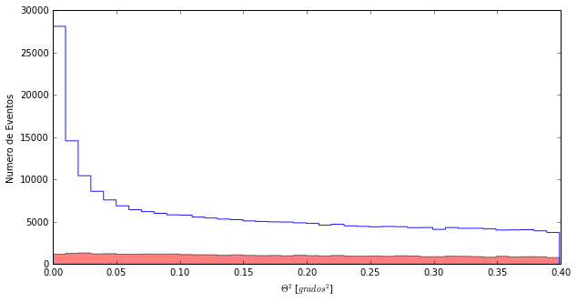
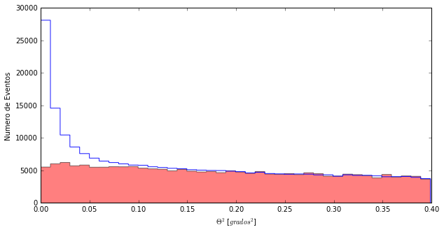
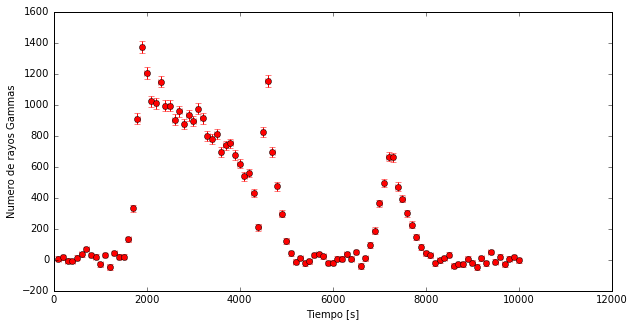

# Leyre's scientific notebook

Surely after spending a night with Daniel, Alba and Quim, you are already an expert in analyzing data and programming with python. And surely a lot of what is in my notebook you already know how to do without help. But I hope I can still teach you something new!

---------

To begin with, let's see if there are gamma rays in the data we take. The VERITAS people were very excited. But it would not be the first time that emotion becomes disappointment.

The **Thetaplot** you already have it under control, right?


```python
import pandas as pd
import numpy as np
import matplotlib.pyplot as pl
%matplotlib inline
```


```python
# We read the files and give them a name
mrk421_ON= pd.read_csv('data/EvtList_ON_Mrk421.txt', sep=' ')
mrk421_OFF= pd.read_csv('data/EvtList_OFF.txt', sep=' ')

# We defined the cut variables had_cut and theta_cut
had_cut = 0.20
theta2_cut = 0.40

# We select the data:
mrk421_ON_cut = mrk421_ON[(mrk421_ON['had'] < had_cut) & (mrk421_ON['theta2'] < theta2_cut)]
mrk421_OFF_cut = mrk421_OFF[(mrk421_OFF['had'] < had_cut) & (mrk421_OFF['theta2'] < theta2_cut)]


pl.figure(1, figsize=(10, 5), facecolor='w', edgecolor='k')
Noff, ThetasOff, _ = pl.hist(mrk421_OFF_cut.theta2, bins=40, histtype='stepfilled', color='red', alpha=0.5, normed=False)
Non, ThetasOn, _ = pl.hist(mrk421_ON_cut.theta2, bins=40, histtype='step', color = 'blue',alpha=0.9, normed=False)
pl.xlabel('$\Theta^2$ [$grados^2$]')
pl.ylabel('Numero de Eventos')
pl.show()
```





True!!! As Mrk 421 was in flare we did not waste time taking OFF data, we took as much ON as we could. You never know how long a flare will last. So we were basically 3 hours in a row taking data ON from Mrk 421. And of course, now the events **ON** and **OFF** do not match.

Well, this has an easy solution. What really interests me is to know what the ** OFF ** is in the area where there is a signal: **Theta Square** small values. So I can search by what factor I have to multiply the **OFF** so that I can match the **ON** to large **Theta Square** values (between 0.25 and 0.35, for example). This factor I use to scale the whole **OFF** and I already have a good estimate of how many **ON** events are not rays gamma that come from Mrk 421.


```python
eventos_off =  sum(Noff[26:35])
eventos_on = sum(Non[26:35])
factor = eventos_on / eventos_off
print ("We need to scale the OFF by a factor:", factor)
```

    ('We need to scale the OFF by a factor:', 4.7118271695349687)


I already have the scale factor, do you understand how I did it? Now let's see how I apply it to all observations events **OFF**.

The easiest way to do it is with weights ... 


```python
pl.figure(2, figsize=(10, 5), facecolor='w', edgecolor='k')
# We create a variable 'weights'. And we fill it with ones (ones_like) multiplied by
# the factor that we just found
weights = np.ones_like(mrk421_OFF_cut.theta2)*factor
# And now we just need to add to the function we already know: pl.hist, a parameter
# weights=weights
Noff, ThetasOff, _ = pl.hist(mrk421_OFF_cut.theta2, bins=40, histtype='stepfilled', color='red', alpha=0.5, normed=False, weights=weights)
Non, ThetasOn, _ = pl.hist(mrk421_ON_cut.theta2, bins=40, histtype='step', color = 'blue',alpha=0.9, normed=False)
pl.xlabel('$\Theta^2$ [$grados^2$]')
pl.ylabel('Numero de Eventos')
pl.show()
```





Wow! Well yes, it was in flare. I have more gamma rays in 3 hours (specifically 10000 seconds) than Daniel, Alba and Quim will ever have.

--------

And in fact, with so many gamma rays we can look if the number that we receive changes over time. Because, in fact, this is what the flares consist of: the number of gamma rays that reach us from a given direction increases for a certain time.

For that, the first thing I need is to read the arrival time of each event **ON**. I will always use the same **OFF**, which does not change over time.

Our data incorporates a new column called **Time** that tells us when the telescope detects each of the gamma rays.

```python
mrk421_ON_cut.head()
```


<div>
<table border="1" class="dataframe">
  <thead>
    <tr style="text-align: right;">
      <th></th>
      <th>Energia</th>
      <th>had</th>
      <th>theta2</th>
      <th>Tiempo</th>
    </tr>
  </thead>
  <tbody>
    <tr>
      <th>24</th>
      <td>90.0</td>
      <td>0.130</td>
      <td>0.333</td>
      <td>8346.26</td>
    </tr>
    <tr>
      <th>31</th>
      <td>172.0</td>
      <td>0.006</td>
      <td>0.003</td>
      <td>9033.70</td>
    </tr>
    <tr>
      <th>32</th>
      <td>85.0</td>
      <td>0.062</td>
      <td>0.239</td>
      <td>1300.29</td>
    </tr>
    <tr>
      <th>34</th>
      <td>61.0</td>
      <td>0.159</td>
      <td>0.268</td>
      <td>2116.28</td>
    </tr>
    <tr>
      <th>54</th>
      <td>3081.0</td>
      <td>0.196</td>
      <td>0.204</td>
      <td>7509.42</td>
    </tr>
  </tbody>
</table>
</div>


And to use the **Tiempo** column, both ON and OFF you know that you just have to do:
> mrk421_ON_cut.Tiempo

----------
Now I want to see how the gamma rays reach us as the seconds pass. Remember that this is a flare, an explosion, so we expect the Gammas number to change over time quickly. But the best thing is to see it with our eyes.

This graph we are looking for is called **Light Curve** and it shows us the number of excesses (**ON - OFF**) that I have in each time interval.

This is how you can do the calculations and the graph.


```python
# How to coimpute a Light Curve

# 1 We prepare the data taking into account that the excesses are calculated with:
#    a / After the cut in hadronness
#    b / Using the events in the first two bins of the Theta Plot,
#        which is Theta Square <0.02
#    c / With OFF and ON normalized
had_cut = 0.20
theta2_cut = 0.02
mrk421_ON_cut_LightCurve = mrk421_ON[(mrk421_ON['had'] < had_cut) & (mrk421_ON['theta2'] < theta2_cut)]
mrk421_OFF_cut_LightCurve = mrk421_OFF[(mrk421_OFF['had'] < had_cut) & (mrk421_OFF['theta2'] < theta2_cut)]
weights = np.ones_like(mrk421_OFF_cut_LightCurve.theta2)*factor

# 2 Compute Non and Noff for each time interval.
# We are going to define 100 intervals (bins) in the 10000 seconds of our data
bins =100
Non, tiempos= np.histogram(mrk421_ON_cut_LightCurve.Tiempo, bins=bins)
Noff, bins_off= np.histogram(mrk421_OFF_cut_LightCurve.Tiempo, bins=tiempos, weights=weights)

# 3 Compute the Excess and its Error for each time interval.

Exceso= Non - Noff
Error= (Non + Noff)**0.5

# 4 Show the Light Curve: the excesses with their errors over time 
pl.figure(1, figsize=(10, 5), facecolor='w', edgecolor='k')
pl.errorbar(tiempos[1:], Exceso, xerr=10000.0/(2.0*bins), yerr= Error, fmt='or', ecolor='red')
pl.xlabel('Tiempo [s]')
pl.ylabel('Numero de rayos Gammas')
pl.show()
```




Cool! The amount of gamma rays changes and it does it very fast. When we are lucky enough to observe a flare like this, we can get a lot of information. Both the source itself and the processes that occur in it, and what happens to the gamma rays as they travel from the source to the earth. What interests me most is this second part!

-------
Note:
Unlike the **Thetaplot**, in step 4 I do not want to represent how many times something happens in my data. I want to show one variable (Number of Excesses) depending on another (Time), with its errors. For that I can not use "pl.hist". That's why I use another function that does exactly what I need:

> pl.errorbar (VariableEjeX, VariableEjeY)

In addition you can give additional parameters to define:

> Error in the X axis: xerr = ???
> Error in Y axis: yerr = ???
> Format of the points: fmt = 'or', o to have a circle in each point and r to be red
> Color to represent the errors: ecolor = 'red'

Thus we represent the number of excesses as a function of time, this is what we call **Light Curve** (light curve).

--------

Now we are going to represent the data in a different way:

We see how the gamma rays detected by the telescope's camera change over the 10000 seconds the flare lasts. If you notice you can clearly see when the flare occurs in the ON, while in the OFF everything remains the same. And, of course, it matches the peaks of the lightcurve. The events are concentrated in the center of the camera because we are pointing to Mrk421.

Why are there detections that are circumferences? The size of the events represents your energy.

```python
from IPython.display import HTML
HTML("""
<video width="600" height="600" controls="" autoplay="" loop="">
  <source src="data/animation_ONOFF.mp4" type="video/mp4">
</video>
""")
```


<video width="600" height="600" controls="" autoplay="" loop="">
  <source src="data/animation_ONOFF.mp4" type="video/mp4">
</video>
