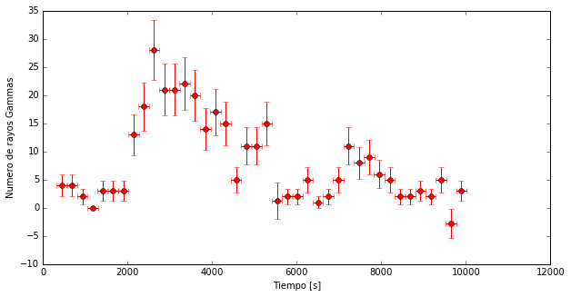
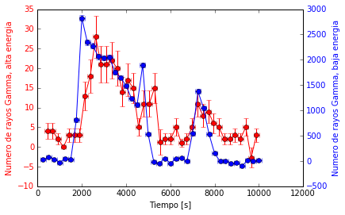

# Desafiant a Einstein

Albert Einstein va dir, la velocitat de la llum en el buit és sempre la mateixa ... Els meus raigs gamma de Mrk421 han viatjat durant molt de temps pel buit per arribar des d'on es van generar fins a la Terra. Vegem si tots han anat a la mateixa velocitat. Com tots han recorregut la mateixa distància, "només" he de mirar si el temps entre que van sortir de Mrk421 i van arribar a la terra és el mateix per a tothom.

------

Comencem carregant llibreries i llegint les dades, com sempre.

```python
import pandas as pd
import numpy as np
import matplotlib.pyplot as pl
%matplotlib inline
```


```python
# Llegim els fitxers i els hi donem un nom
mrk421_ON= pd.read_csv('data/EvtList_ON_Mrk421.txt', sep=' ')
mrk421_OFF= pd.read_csv('data/EvtList_OFF.txt', sep=' ')

# Definim les variables de tall had_cut i theta_cut per fer el Light Curve
# (Recordes, posem el tall per calcular els excessos, no per fer el Theta Plot)
had_cut = 0.20
theta2_cut = 0.02

# Seleccionem les dades:
mrk421_ON_cut = mrk421_ON[(mrk421_ON['had'] < had_cut) & (mrk421_ON['theta2'] < theta2_cut)]
mrk421_OFF_cut = mrk421_OFF[(mrk421_OFF['had'] < had_cut) & (mrk421_OFF['theta2'] < theta2_cut)]

# Farem servir el factor de normalització de l'OFF que hem trobat abans
factor = 4.71
```


```python
mrk421_ON_cut.head()
```


<div>
<table border="1" class="dataframe">
  <thead>
    <tr style="text-align: right;">
      <th></th>
      <th>Energia</th>
      <th>had</th>
      <th>theta2</th>
      <th>Tiempo</th>
    </tr>
  </thead>
  <tbody>
    <tr>
      <th>31</th>
      <td>172.0</td>
      <td>0.006</td>
      <td>0.003</td>
      <td>9033.70</td>
    </tr>
    <tr>
      <th>75</th>
      <td>65.0</td>
      <td>0.157</td>
      <td>0.018</td>
      <td>4643.12</td>
    </tr>
    <tr>
      <th>170</th>
      <td>367.0</td>
      <td>0.097</td>
      <td>0.003</td>
      <td>2497.60</td>
    </tr>
    <tr>
      <th>196</th>
      <td>177.0</td>
      <td>0.074</td>
      <td>0.009</td>
      <td>3845.38</td>
    </tr>
    <tr>
      <th>226</th>
      <td>875.0</td>
      <td>0.008</td>
      <td>0.001</td>
      <td>3654.35</td>
    </tr>
  </tbody>
</table>
</div>


A les dades de Mrk421 tenim la columna **Tiempo** que indica el moment en que el telescopi detecta els raigs gamma.

La pregunta és, com puc saber quant temps ha trigat cadascun dels raigs gamma per viatjar des Mrk421 fins a la Terra? La resposta: no puc. Només sé quan arriben a la Terra.

Però si tinc dades a les què la quantitat de raigs gamma canvia amb el temps, puc mirar si aquest canvi succeeix en el mateix moment independentment de la _energia_ dels **raigs gamma**.

Els **raigs gamma** són fotons i quan entren a l'atmosfera terrestre interaccionen amb les seves molècules i generen una cascada de partícules. Alguns fotons arriben a la Terra amb més energia que altres. Com més energia tenen més "fortament" xoquen amb les molècules de l'atmosfera i es generen més partícules. Si hi ha més partícules, amb MAGIC veiem més llum. Això ens permet assignar a cada esdeveniment una energia. Als fitxers:

> ** EvtList_ON_Mrk421.txt ** i ** EvtList_OFF.txt **

No només tenim el **Hadronness**, el **Theta Quadrat** i el **Temps** per a cada esdeveniment, també tenim la seva **Energia** en GeV. I podem seleccionar els Raigs gamma de major energia d'una banda i els de menor energia per un altre. Així els podem analitzar de forma independent.

La majoria (si no totes) de les teories que prediuen que la velocitat de la llum en el buit no és sempre la mateixa, indiquen que aquesta velocitat depèn de l'energia de la llum, l'energia dels **raigs gamma**.

Definim dos intervals d'energia en les nostres dades: **Baixes** (Energia <100 GeV) i **Altes** (Energia> 500 GeV). Per tenir això, fem el mateix que hem fet per tallar a **Theta Quadrat** o **Hadronness**.


```python
# 1 Definim els talls d'"altes energies" i "baixes energies"
cut_highE = 5000
cut_lowE = 1000

# 2 Seleccionem les dades
#Alta Energia
mrk421_ON_cut_highE =mrk421_ON_cut[mrk421_ON_cut['Energia']>cut_highE]
mrk421_OFF_cut_highE =mrk421_OFF_cut[mrk421_OFF_cut['Energia']>cut_highE]

# Baixa Energia
mrk421_ON_cut_lowE =mrk421_ON_cut[mrk421_ON_cut['Energia']<cut_lowE]
mrk421_OFF_cut_lowE =mrk421_OFF_cut[mrk421_OFF_cut['Energia']<cut_lowE]
```

Si assumim que quan es produeix un **flare**, la font augmenta en el mateix moment el nombre de fotons per a totes les energies, podem fer un **Light Curve** per als dos rangs d'energia i mirar si per als dos , la quantitat de **raigs gamma** que veiem creix en el mateix moment.
------

Primer farem el **LightCurve** per a altes energies. Després per baixes. I després els combinarem.
Ara, en comptes d'utilitzar 100 intervals de temps, en farem servir 40.


```python
#LightCurve Altes energies

weights_high = np.ones_like(mrk421_OFF_cut_highE.theta2)*factor

# 1 Calcular Non i Noff per a cada interval de temps.
# Definim 40 intervals (bins) en els 10000 segons de nostres dades
bins = 40
Non, tiempos_highE= np.histogram(mrk421_ON_cut_highE.Tiempo, bins=bins)
Noff, bins_off= np.histogram(mrk421_OFF_cut_highE.Tiempo, bins=tiempos_highE, weights=weights_high)

# 2 Calcular el Excés i el Error per a cada interval de temps.
Exceso_highE= Non - Noff
Error_highE = (Non+Noff)**0.5

# 3 Representar el lightcurve: els excessos amb els seus errors al llarg del temps
pl.figure(1, figsize=(10, 5), facecolor='w', edgecolor='k')
pl.errorbar(tiempos_highE[1:], Exceso_highE, xerr=10000.0/(2.0*bins), yerr= Error_highE, fmt='or', ecolor='red')
pl.xlabel('Tiempo [s]')
pl.ylabel('Numero de rayos Gammas')
pl.show()
```





```python
#LightCurve Baixes Energies

weights_low = np.ones_like(mrk421_OFF_cut_lowE.theta2)*factor

# 1 Calcular Non i Noff per a cada interval de temps.
# Definim 40 intervals (bins) en els 10000 segons de les nostres dades
bins =40
Non, tiempos_lowE= np.histogram(mrk421_ON_cut_lowE.Tiempo, bins=bins)
Noff, bins_off= np.histogram(mrk421_OFF_cut_lowE.Tiempo, bins=tiempos_highE, weights=weights_low)

# 2 Calcular el Excés i el Error per a cada interval de temps.
Exceso_lowE= Non - Noff
Error_lowE = (Non+Noff)**0.5

# 3 Representar el lightcurve: els excessos amb els seus errors al llarg del temps
pl.figure(1, figsize=(10, 5), facecolor='w', edgecolor='k')
pl.errorbar(tiempos_lowE[1:], Exceso_lowE, xerr=10000.0/(2.0*bins), yerr= Error_lowE, fmt='or', ecolor='red')
pl.xlabel('Tiempo [s]')
pl.ylabel('Numero de rayos Gammas')
pl.show()

```


A primera vista veiem que arriben més Gammas de baixa energia que d'alta energia. I això és el que esperem.

Però per veure si hi ha alguna diferència de temps entre les dues ** Light Curve ** millor posar les dues en el mateix gràfic. I de pas, posarem cadascuna amb el seu eix del mateix color que els punts. Vegem com fer-ho.

```python
# 4 Representar els excessos amb els seus errors al llarg del temps

# Fem servir la funció "pl.subplots ()" del qual podem recuperar els eixos a ax1
fig, ax1 = pl.subplots()
# Ara en lloc de cridar pl.errorbar, l'anomenem amb ax1.errorbar i
# també posem títol a l'eix
ax1.errorbar(tiempos_highE[1:], Exceso_highE, xerr=10000.0/(2.0*bins), yerr=Error_highE, fmt='-or', ecolor='red')
ax1.set_ylabel('Numero de rayos Gamma, alta energia', color='r')

# Ara la Light Curve per a Baixa Energia
ax2 = ax1.twinx()
ax2.errorbar(tiempos_lowE[1:], Exceso_lowE, xerr=10000.0/(2.0*bins), yerr=Error_lowE, fmt='-ob', ecolor='blue')
ax2.set_ylabel('Numero de rayos Gamma, baja energia', color='b')
# La Light Curve per Alta Energia l'he posat en vermell (r de red) i
# la de baixa en blau (b de blue).
# Fem el mateix per als eixos, així queda clar què és què.
for tl in ax1.get_yticklabels():
    tl.set_color('r')
for tl in ax2.get_yticklabels():
    tl.set_color('b')
ax1.set_xlabel('Tiempo [s]')
pl.show()

```





Aquest flare està ple de coses interessants, sembla clar que la quantitat de **raigs gamma** d'Alta Energia (Vermell) augmenten després que ho facin els de Baixa Energia (Blau). Vol dir això que Einstein estava equivocat ...?

-----
Nota:
Per cert, per poder comparar millor les dues **Light Curve** he dibuixat una línia per unir els punts. Ho faig amb la "-" que poso en "fmt = '- or'" i "fmt = '- ob'".

-----
Ara podem visualitzar els esdeveniments detectats per la càmera com hem fet abans, però separant-los per energia:


```python
from IPython.display import HTML
HTML("""
<video width="600" height="600" controls="" autoplay="" loop="">
  <source src="data/animation_HighLow.mp4" type="video/mp4">
</video>
""")
```


<video width="600" height="600" controls="" autoplay="" loop="">
  <source src="data/animation_HighLow.mp4" type="video/mp4">
</video>
