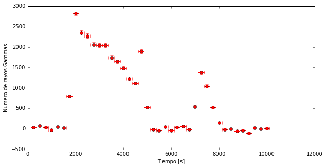

# Defying Einstein

Albert Einstein said, the speed of light in a vacuum is always the same ... My gamma rays of Mrk421 have traveled for a long time through vacuum to get from where they were generated to Earth. Let's see if everyone has gone at the same speed. As everyone has traveled the same distance, "only" I have to look if the time between leaving Mrk421 and arriving on earth is the same for everyone.

------

Let's start loading libraries and reading the data, as always.

```python
import pandas as pd
import numpy as np
import matplotlib.pyplot as pl
%matplotlib inline
```


```python
# We read the files and give them a name
mrk421_ON= pd.read_csv('data/EvtList_ON_Mrk421.txt', sep=' ')
mrk421_OFF= pd.read_csv('data/EvtList_OFF.txt', sep=' ')

# We defined the cut variables had_cut and theta_cut to make the Light Curve
# (remember, we put the cut to calculate the excesses, not to make the Theta Plot)had_cut = 0.20
theta2_cut = 0.02

# We select the data:
mrk421_ON_cut = mrk421_ON[(mrk421_ON['had'] < had_cut) & (mrk421_ON['theta2'] < theta2_cut)]
mrk421_OFF_cut = mrk421_OFF[(mrk421_OFF['had'] < had_cut) & (mrk421_OFF['theta2'] < theta2_cut)]

# We will use the OFF normalization factor that we found before 
factor = 4.71
```


```python
mrk421_ON_cut.head()
```


<div>
<table border="1" class="dataframe">
  <thead>
    <tr style="text-align: right;">
      <th></th>
      <th>Energia</th>
      <th>had</th>
      <th>theta2</th>
      <th>Tiempo</th>
    </tr>
  </thead>
  <tbody>
    <tr>
      <th>31</th>
      <td>172.0</td>
      <td>0.006</td>
      <td>0.003</td>
      <td>9033.70</td>
    </tr>
    <tr>
      <th>75</th>
      <td>65.0</td>
      <td>0.157</td>
      <td>0.018</td>
      <td>4643.12</td>
    </tr>
    <tr>
      <th>170</th>
      <td>367.0</td>
      <td>0.097</td>
      <td>0.003</td>
      <td>2497.60</td>
    </tr>
    <tr>
      <th>196</th>
      <td>177.0</td>
      <td>0.074</td>
      <td>0.009</td>
      <td>3845.38</td>
    </tr>
    <tr>
      <th>226</th>
      <td>875.0</td>
      <td>0.008</td>
      <td>0.001</td>
      <td>3654.35</td>
    </tr>
  </tbody>
</table>
</div>

In Mrk421 data, we have the column **Tiempo** that indicates the moment in which the telescope detects the gamma rays.

The question is, how can I know how long each of the gamma rays has taken to travel from Mrk421 to Earth? The answer: I can not. I only know when they arrive on Earth.

But if I have data in which the amount of gamma rays changes over time, I can see if that change happens at the same time regardless of the _energy_ of the **gamma rays**.

The **gamma rays** are photons and when they enter the Earth's atmosphere they interact with their molecules and generate a cascade of particles. Some photons come to Earth with more energy than others. The more energy they have the more "strongly" they collide with the molecules of the atmosphere and more particles are generated. If there are more particles, with MAGIC we see more light. This allows us to assign each event an energy. In the files:

> ** EvtList_ON_Mrk421.txt ** and ** EvtList_OFF.txt **

We do not only have the **Hadronness**, the **Theta Square** and the **Time** for each event, we also have their **Energy** in GeV. And we can select the higher energy gamma rays on one side and the lower energy gamma rays on the other. This way we can analyze them independently.

Most (if not all) of the theories that predict that the speed of light in a vacuum is not always the same, indicate that this speed depends on the energy of light, the energy of the **gamma rays**.

Define two energy intervals in our data: **Low** (Energy <100 GeV) and **High** (Energy> 500 GeV). To have this, we do the same thing we did to cut on **Theta Square** or **Hadronness**.


```python
# 1 We define the cuts of "high energies" and "low energies"
cut_highE = 5000
cut_lowE = 1000

# 2 We select the data
# High energy
mrk421_ON_cut_highE =mrk421_ON_cut[mrk421_ON_cut['Energia']>cut_highE]
mrk421_OFF_cut_highE =mrk421_OFF_cut[mrk421_OFF_cut['Energia']>cut_highE]

# Low Energy
mrk421_ON_cut_lowE =mrk421_ON_cut[mrk421_ON_cut['Energia']<cut_lowE]
mrk421_OFF_cut_lowE =mrk421_OFF_cut[mrk421_OFF_cut['Energia']<cut_lowE]
```

If we assume that when a **flare** occurs, the source increases at the same time the number of photons for all energies, we can make a **Light Curve** for the two energy ranges and check if for both, the amount of **gamma rays** we see grows at the same time.

------

First we will do the **LightCurve** for high energies. Then for low energies. And finally we will combine them.
This time, instead of using 100 time slots, we will use 40.


```python

#LightCurve High Energy
weights_high = np.ones_like(mrk421_OFF_cut_highE.theta2)*factor

# 1 Calculate Non and Noff for each time interval.
# We define 40 intervals (bins) in the 10000 seconds of our data
bins = 40
Non, tiempos_highE= np.histogram(mrk421_ON_cut_highE.Tiempo, bins=bins)
Noff, bins_off= np.histogram(mrk421_OFF_cut_highE.Tiempo, bins=tiempos_highE, weights=weights_high)

# 2 Calculate the Excess and the Error for each time interval.
Exceso_highE= Non - Noff
Error_highE = (Non+Noff)**0.5

# 3 Represent the lightcurve: the excesses with their errors over time
pl.figure(1, figsize=(10, 5), facecolor='w', edgecolor='k')
pl.errorbar(tiempos_highE[1:], Exceso_highE, xerr=10000.0/(2.0*bins), yerr= Error_highE, fmt='or', ecolor='red')
pl.xlabel('Tiempo [s]')
pl.ylabel('Numero de rayos Gammas')
pl.show()
```


```python

#LightCurve Low Energy
weights_low = np.ones_like(mrk421_OFF_cut_lowE.theta2)*factor

# 1 Calculate Non and Noff for each time interval.
# We define 40 intervals (bins) in the 10000 seconds of our data
bins =40
Non, tiempos_lowE= np.histogram(mrk421_ON_cut_lowE.Tiempo, bins=bins)
Noff, bins_off= np.histogram(mrk421_OFF_cut_lowE.Tiempo, bins=tiempos_highE, weights=weights_low)

# 2 Calculate the Excess and the Error for each time interval.
Exceso_lowE= Non - Noff
Error_lowE = (Non+Noff)**0.5

# 3 Represent the lightcurve: the excesses with their errors over time
pl.figure(1, figsize=(10, 5), facecolor='w', edgecolor='k')
pl.errorbar(tiempos_lowE[1:], Exceso_lowE, xerr=10000.0/(2.0*bins), yerr= Error_lowE, fmt='or', ecolor='red')
pl.xlabel('Tiempo [s]')
pl.ylabel('Numero de rayos Gammas')
pl.show()

```





At first glance we see that more Gammas of low energy than high energy arrive. And that is what we expect.

But to see if there is any time difference between the two **Light Curve** it is better to put the two of them on the same graph. And by the way, we will put each one with its axis of the same color as the points. Let's see how to do it.

```python
# 4 Represent the excesses with their mistakes over time

# We use the function "pl.subplots ()" from which we can recover the axes in ax1
fig, ax1 = pl.subplots()
# Now instead of calling pl.errorbar, we call it with ax1.errorbar and
# we also put title to the axis
ax1.errorbar(tiempos_highE[1:], Exceso_highE, xerr=10000.0/(2.0*bins), yerr=Error_highE, fmt='-or', ecolor='red')
ax1.set_ylabel('Numero de rayos Gamma, alta energia', color='r')

# First the Light Curve for Low Energy
ax2 = ax1.twinx()
ax2.errorbar(tiempos_lowE[1:], Exceso_lowE, xerr=10000.0/(2.0*bins), yerr=Error_lowE, fmt='-ob', ecolor='blue')
ax2.set_ylabel('Numero de rayos Gamma, baja energia', color='b')
# The Light Curve for High Energy I have put it in red (r) and
# the low one in blue (b).
# Let us do the same for the axes, so it is clear what is what.
for tl in ax1.get_yticklabels():
    tl.set_color('r')
for tl in ax2.get_yticklabels():
    tl.set_color('b')
ax1.set_xlabel('Tiempo [s]')
pl.show()

```


This flare is full of interesting things, it seems clear that the amount of High Energy (Red) **gamma rays** increases after the Low Energy (Blue) gamma-rays do. Does this mean that Einstein was wrong ...?

-----
Note:
By the way, in order to better compare the two **Light Curve** I have drawn a line to join the points. I do it with the "-" that I put in "fmt = '- or'" and "fmt = '- ob'".

-----
Now we can visualize the events detected by the camera as we did before, but separating them by energy:


```python
from IPython.display import HTML
HTML("""
<video width="600" height="600" controls="" autoplay="" loop="">
  <source src="data/animation_HighLow.mp4" type="video/mp4">
</video>
""")
```


<video width="600" height="600" controls="" autoplay="" loop="">
  <source src="data/animation_HighLow.mp4" type="video/mp4">
</video>
