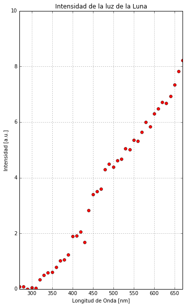
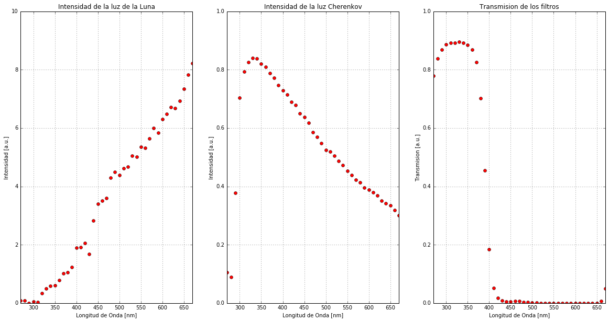

# La libreta científica de Daniel
Esta es mi **libreta científica**. Aquí puedo ver los **datos** de los telescopios, hacer **cálculos** y **anotaciones**. Es una herramienta más de los Cazadores de Rayos Gamma. Todos los azadores tenemos la nuestra y tu tienes la tuya en ** Tu Noche **.

Lo mejor es entender cómo funciona con un ejemplo. Así que vamos a calcular si los filtros que hemos diseñado son los adecuados o no.

Tenemos 3 conjuntos de datos. 
- Uno tiene los datos de la cantidad de **luz de luna** que llega a los telescopios.
- Otro tiene los datos de la **luz de los rayos gammas** que nos llega a los telescopios.
- El último tiene la información de cuánta luz (de la luna o de los gammas) pasa por el filtro. 

Cada fichero nos muestra la información por longitud de onda.

**¡ATENCIÓN!** Recuerda que para ejecutar el código que hay en cada una de las celdas de comandos debes pulsar *SHIFT+ENTER*.  
Y si por cualquier razón haces doble click en una celda de texto com esta, verás el texto sin formato. haciendo *SHIFT+ENTER* lo volverás a ver bien.


Leamos por ejemplo el conjunto de datos que nos indica la cantidad de **luz de la luna** que llega a los telescopios:


```python
%matplotlib inline
from noche1_2 import *
```


```python
leer("luna")
```

    LongitudOnda  Emision 
    ------------ ---------
             270    0.0921
             280  0.077652
             290 0.0042408
             300  0.049055
             310  0.034728
             320   0.33099
             330    0.4941
             340   0.58336
             350   0.59861
             360   0.79136
             ...       ...
             570    5.6372
             580    6.0073
             590    5.8452
             600    6.3041
             610    6.4821
             620    6.7191
             630    6.6753
             640    6.9272
             650    7.3382
             660    7.8201
             670    8.2151
    Length = 41 rows


-----------
Esto es lo que significa cada columna
- La primera columna es la **Longitud de onda** medida en nanómetros.
- La segunda es la **intensidad de la emisión de la luna**. Las unidades de la intensidad son arbitrarias (a.u).

Mirar así los datos sirve para ver qué formato tienen, pero para sacar más información de ellos es mucho mejor representarlo gráficamente.

Atento a los ejes de la gráfica. En el eje de las X tenemos la longitud de onda, y en el de las Y tenemos la emisión de la Luna. Fíjate también en la escala del eje de las Y.


```python
grafica("luna")
```





Con el gráfico es fácil de ver que la cantidad de **luz de luna** (por cierto, ya sabes que en realidad no es luz de luna ya que la luna solo la refleja, ¿no?) aumenta para longitudes de onda mayores.

----------

Miremos qué pasa con la **luz de los rayos gamma** y los filtros: 


```python
grafica("luna")
grafica("gammas")
grafica("filtro")
```





Ahora podemos comparar cuanta luz nos llega de la luna y cuanta nos llega de los gammas.

- **¿De cuál nos llega más intensidad? ¿De la Luna o de los Gammas?**
- **¿Sabes ver qué parte de la luz deja pasar el filtro y qué parte la absorbe?**

La luz que nos llega de los gamma aumenta muy rápido con la longitude de onda entre 250 y 350 nanómetros, pero después, al contrario de la que nos llega de la luna, disminuye para longitudes de onda mayores. Por esos escogimos un filtro que tuviera una buena transmisión por debajo de 350 nanómetros y que no dejara pasar luz por encima de 400 nanómetros.

----------

Es el momento de calcular cuánta luz de la luna y de los gammas pasa el filtro. El objetivo es que el filtro elimine la luna pero no los gammas. Pero no hay ningún filtro perfecto.

El cálculo es simple: debemos multiplicar *la intensidad de la luna* por *el filtro* para cada longitud de onda.


```python
multiplicar("luna","filtro")
```

    totalluna: 144.48
    lunafiltrada:
    [  7.18380000e-02   6.51500280e-02   3.68525520e-03   4.34627300e-02
       3.09773760e-02   2.95574070e-01   4.42713600e-01   5.20357120e-01
       5.29769850e-01   6.87691840e-01   8.37316200e-01   7.43137200e-01
       5.62607500e-01   3.47318400e-01   9.97204000e-02   3.71880000e-02
       1.34568000e-02   1.41795000e-02   1.69920000e-02   2.11032000e-02
       2.16384000e-02   1.72076000e-02   1.34841000e-02   4.39160000e-03
       4.62880000e-03   9.34700000e-04   4.04688000e-04   3.00882000e-04
       3.74871000e-04   2.12456000e-04   0.00000000e+00   0.00000000e+00
       0.00000000e+00   0.00000000e+00   0.00000000e+00   0.00000000e+00
       6.67530000e-05   4.15632000e-04   7.33820000e-04   4.69206000e-02
       4.10755000e-01]
    totallunaFiltrada: 5.91


----------------

Y lo mismo para la luz de los gammas:


```python
multiplicar("gammas", "filtro")
```

    totalgammas: 22.36
    gammasfiltrada
    [  8.22120000e-02   7.50905000e-02   3.28568900e-01   6.22946600e-01
       7.08158800e-01   7.37975200e-01   7.53177600e-01   7.47942000e-01
       7.26408000e-01   7.03021000e-01   6.51714000e-01   5.42575800e-01
       3.39794000e-01   1.34264800e-01   3.71436000e-02   1.24290000e-02
       5.43600000e-03   3.25500000e-03   3.19050000e-03   3.70620000e-03
       3.51840000e-03   2.27640000e-03   1.64160000e-03   5.24400000e-04
       5.19700000e-04   1.01160000e-04   3.89920000e-05   2.83140000e-05
       3.16680000e-05   1.75800000e-05   0.00000000e+00   0.00000000e+00
       0.00000000e+00   0.00000000e+00   0.00000000e+00   0.00000000e+00
       3.51200000e-06   2.05260000e-05   3.33900000e-05   1.91700000e-03
       1.50750000e-02]
    totalgammasFiltrada: 7.24


--------
Como puedes ver, para la luna pasamos de **totalluna = 144** a **totallunafiltrada = 6**, es decir que nos quedamos con 4% de la luz de la Luna.

En cambio, para los gammas pasamos de **totalgammas = 22** a ** totalgammasFiltrada = 7**, que es una reducción mucho menor.

Hagamos los números:


```python
totallunaFiltrada/totalluna
```


    0.040883189190507568


```python
totalcherenkovFiltrada/totalcherenkov
```


    0.32407190844270289


¿Qué te parece? ¿Los filtros funcionan? ¿Pasa más luz de la Luna o más luz de los Gammas en proporción?  

Los filtros no son perfectos, pero funcionan bastante bien. Así que ahora podremos observar incluso con Luna llena. Así tendremos más horas para seguir buscando Gammas. Y eso, como verás, es muy importante.  

Esta es tu primera libreta científica, tu primer paso como Cazador de Rayos Gamma. Sigue adelante en la noche, te esperan muchas sorpresas de alta energía.
